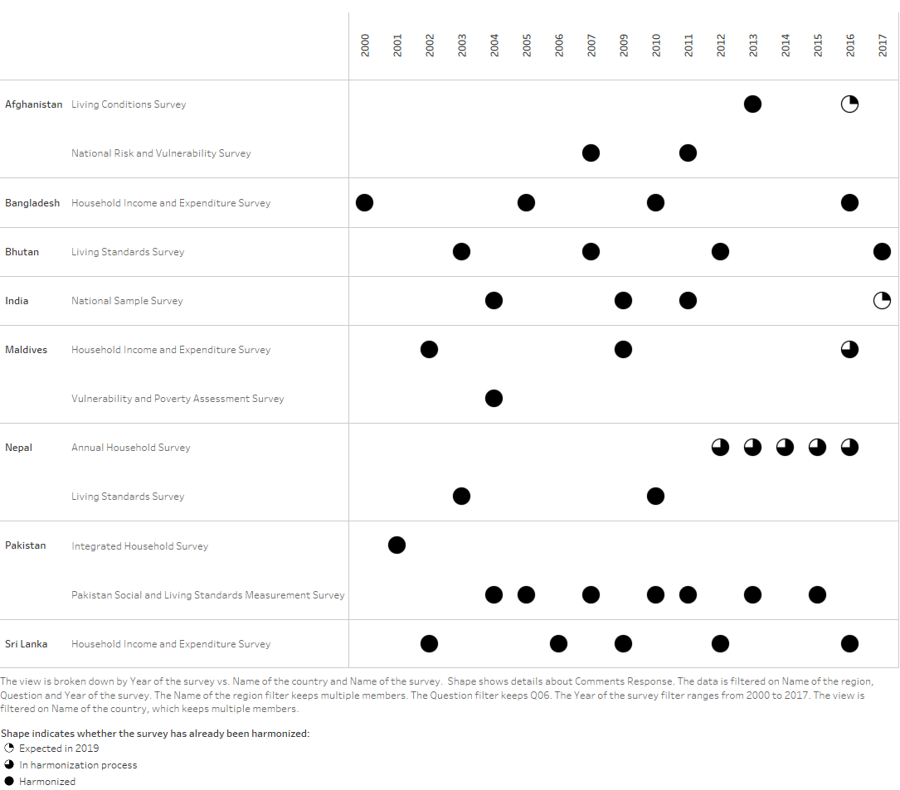
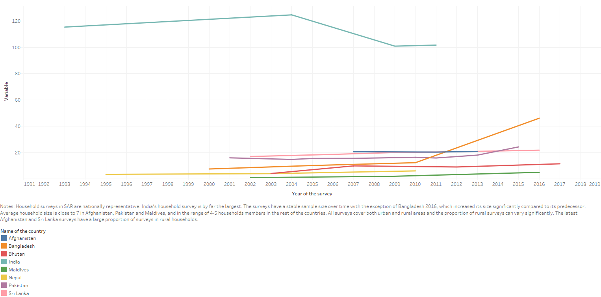

---
output:
  pdf_document: default
  html_document: default
  word_document: default
---
# Metadata Analysis {#metadata}
***
[](https://tab.worldbank.org/#/site/WBG/views/SAR_MNA_Summary/Cover)

This chapter provides an overview of household surveys metadata in South Asia with the support of a series of accompanying Tableau dynamic dashboards. You may acess the Tableau dashboards by clicking on them and on the figures' titles. 

The South Asia Micro Database (SARMD) is a regional database of socio-economic indicators established in 2014 and managed by the South Asia Region Team for Statistical Development (SARTSD). It follows the Global Monitoring Database (GMD) harmonization guidelines, including the construction of the welfare aggregate used for global poverty monitoring. SARMD consists of raw household survey data, documentation, questionnaires, and a repository of do files to reconstruct harmonized variables, consumption aggregates, and poverty estimates. SARMD currently includes the eight countries in the region (Afghanistan, Bangladesh, Bhutan, India, Maldives, Nepal, Pakistan, and Sri Lanka), contemplates forty-three surveys, and contains close to a hundred harmonized variables covering the 1993-2017 period. Table \@ref(tab:latest) shows the latest available household surveys in SARMD and provides links to the National Statistics Offices' websites.

```{r latest, echo=FALSE, warning=FALSE, eval=TRUE, error=FALSE, results='markup', tidy=TRUE, cache=FALSE}
library(readr)
latest <- read_csv("~/SARMD_User_Guidelines/SARMD_guidelines/tables/latest.csv",col_names = TRUE)
knitr::kable(latest,booktabs=TRUE, caption = 'Latest household surveys available in SARMD')
```

## Inventory

Considering that the South Asia region (SAR) has the second largest poor population in the world, it is essential to improve the frequency and regularity of poverty data. Figure \@ref(fig:inv) presents the surveys that make part of the South Asia Micro Database (SARMD). Four countries have released recent rounds of household surveys (Pakistan 2015, Bangladesh 2016, Sri Lanka 2016, and Bhutan 2017) while others are about to release a new round in the next year (Afghanistan 2016, Maldives 2016, India 2017). Nepal has collected five rounds of its Annual Household Survey (AHS) while it waits for the fourth round of the Nepal Living Standards Survey. 

Extreme data deprivation may be measured as having less than two data points in a ten year period. The inventory section shows that in 2019 the region of South Asia is not considered extremely data deprived. Still, unless they collect surveys more frequently, three countries are vulnerable to extreme data deprivation by 2022: Bangladesh, Maldives and India. 

```{r inv, echo=FALSE, fig.cap='[SARMD Inventory](https://tab.worldbank.org/#/site/WBG/views/SAR_MNA_Metadata/Availability)', fig.asp=.75, fig.align='center'}

```

## Sample size

India’s household survey is by far the largest as shown in Figure \@ref(fig:ssize). The surveys have a stable sample size over time except for Bangladesh 2016, which increased its size compared to its predecessor. All surveys cover both urban and rural areas and the proportion of rural surveys can vary significantly. The latest Afghanistan and Sri Lanka surveys have collected a large proportion of surveys in rural households (above 80% of households).

```{r ssize, echo=FALSE, fig.cap='[Sample Size](https://tab.worldbank.org/#/site/WBG/views/SAR_MNA_Metadata/Lines)', fig.asp=.75, fig.align='center'}

```

## Household survey description by country

The content of these surveys varies widely and their comparison over time even within the same country is a major challenge. We provide a brief overview of survey collection for each country below: 

### Afghanistan

```{r afg, echo=FALSE, out.width='40%', fig.asp=.75, fig.align='left'}
knitr::include_graphics("figures/Flag_of_Afghanistan.svg")
```

The Afghanistan Living Conditions Survey (ALCS) 2016-2017 represents the entire population of Afghanistan and may be disaggregated by urban and rural population, and by the nomadic Kuchi population. Previously, the survey was named National Risk and Vulnerability Assessment (NRVA). This survey covers 35 strata, 34 for the provinces of Afghanistan and one for the nomadic Kuchi population. Stratification by season was achieved by equal distribution of data collection over 12 months within the provinces for the latest round between April 2016 and March 2017. In the first three months of fieldwork, areas that were inaccessible due to insecurity were replaced by sampled areas that were scheduled for a later month, in the hope that over time security conditions would improve. Eventually, some clusters in inaccessible areas were replaced by clusters that excluded insecure areas. 

The Central Statistics Organization (CSO) (http://cso.gov.af/) has used the ALCS 2016 to report that poverty rates in Afghanistan have experienced a sharp increase since 2011-12, especially in rural areas. Households of larger size face a higher poverty rate. Although larger land size is no guarantee for escaping poverty, the smaller the size of land owned by households, the higher is the proportion that falls below the poverty line. Lack of education is another important correlate of poverty in Afghanistan. Low levels of educational attainment are pervasive and households with illiterate heads account for 74 percent of the population. 

### Bangladesh

```{r bgd,  echo=FALSE, out.width='40%', fig.asp=.75, fig.align='left'}
knitr::include_graphics("figures/Flag_of_Bangladesh.svg")
```

The Household Income and Expenditure Survey (HIES) is the comprehensive nationally representative survey used to measure poverty in Bangladesh. The HIES 2016/17 is the fourth round in the series of HIES conducted by the Bangladesh Bureau of Statistics (BBS) (http://bbs.gov.bd/) in 2000, 2005, and 2010. As of 2016, Bangladesh had eight administrative divisions. These were Barisal, Chittagong, Dhaka, Khulna, Mymensingh, Rajshahi, Rangpur and Sylhet. These 8 divisions of the country were stratified by rural, urban and city corporation, however, city corporations were only considered for Dhaka, Chittagong, Khulna and Rajshahi. This brought the number of strata to 20 (8 rural divisions, 8 urban divisions, and 4 city corporations). 

Based on the HIES 2016, the BBS reports that poverty was reduced substantially between 2010 and 2016. In 2010, the poverty headcount ratio, using a higher poverty line, was 31.5% which reduced to 24.3% in 2016. Using a lower poverty line the headcount ratio also reduced from 17.6% in 2010 to 12.9% in 2016. Using the higher upper poverty line, Rangpur had the highest incidence of poverty at 47.2%, followed by Mymensingh 32.8%, Rajshahi 28.9% and Khulna 27.5%. On the other hand, Dhaka recorded the lowest headcount ratio of 16.0%, followed by Sylhet 16.2%, and Chittagong 18.4%. 

### Bhutan

```{r btn,  echo=FALSE, out.width='40%', fig.asp=.75, fig.align='left'}
knitr::include_graphics("figures/Flag_of_Bhutan.svg")
```

The Bhutan Living Standards Survey (BLSS) 2017 is the fourth in a series of living standards surveys undertaken by the National Statistics Bureau (NSB) (http://nsb.gov.bt). Earlier surveys were done in 2003, 2007, and 2012 to collect information on the demographics, education, health, employment, housing, access to services, asset ownership, credit, self-perceived poverty, and happiness of the population. The BLSS 2017 included 11,660 households with 48,639 individuals. The sample for BLSS 2017 was designed to provide estimates for a large number of indicators on the living conditions of Bhutanese in both urban and rural areas of the twenty Dzongkhags, including the four Thromdes (Thimphu, Phuentsholing, Gelephu and Samdrup Jongkhar). 

The NSB reports a population poverty rate of 8.2% in 2017. The 2017 BLSS shows that the mean monthly household expenditure for the country is Nu33,542: Nu45,508 in urban areas, and Nu26,937 in rural areas. The mean monthly per capita household expenditure is Nu7,939. The monthly per capita household expenditure ofNu11,452 in urban areas is 85% higher than that in rural areas (Nu6,174). The mean per capita expenditure of households in the richest per capita consumption quintile of Nu17,802 is more than seven times that of households in the poorest per capita consumption quintile (Nu2,468).

The NSB has also analyzed subjective happiness ratings by dzongkhags. Pema Gatshel is the happiest Dzongkhag (94%) followed by Samtse (more than 88%) and Trongsa Dzongkhags (more than 86%). The exception is Dagana Dzongkhag, where only four in every 10 respondents reported they are happy. Dagana also stands out as the Dzongkhag with the highest poverty rate. 

### India

```{r ind, echo=FALSE, out.width='40%', fig.asp=.75, fig.align='left'}
knitr::include_graphics("figures/Flag_of_India.svg")
```

Despite India's remarkable progress in reducing poverty, poverty remains widespread especially in the highly-populated Eastern states of Bihar, Chhattisgarh, Jharkhand, Madhya Pradesh, Odisha, and Uttar Pradesh. The national poverty estimates for India are based on rounds of Household Consumption Expenditure Surveys conducted by the National Sample Survey Office (NSSO) (http://mospi.gov.in/). The 68th round (July 2011-June 2012) of NSS is designated to measure household consumer expenditure, employment, and unemployment. The 68th round is the most recent round for which consumption data is currently available in SARMD. The survey covers the whole of the Indian Union except interior villages of Nagaland situated beyond five kilometers of the bus route and villages in Andaman and Nicobar Islands which remain inaccessible throughout the year. 

In the 68th round two schedule types exist. The two schedule types differ by their reference periods (in the 68th round, Schedule Type 1 and Schedule Type 2 use the same reference periods as in the 66th round). Sample households were divided into two sets: Schedule Type 1 was canvassed in one set and Schedule Type 2 in the other. Schedule Type 1 requires that for certain non-food items (clothing, bedding, footwear, education, medical (institutional), durable goods), the same household should report data for two reference periods: the last 30 days and the last 365 days. For these same non-food items, the reference period used in Schedule Type 2 is only the last 365 days. As in the 66th round, items of food, pan, tobacco and intoxicants (food-plus category) are split into 2 blocks, block 5.1 and block 5.2, instead of being placed in a single block. Block 5.1 consists of cereals, pulses, milk and milk products, sugar and salt. This block has a reference period of 30 days in both Schedule Type 1 and Schedule Type 2. Block 5.2 consists of the other items of food, along with pan, tobacco and intoxicants. This block is assigned a reference period of last 30 days in Schedule Type 1 and a reference period of last 7 days in Schedule Type 2. 

### Maldives

```{r mdv, echo=FALSE, out.width='40%', fig.asp=.75, fig.align='left'}
knitr::include_graphics("figures/Flag_of_Maldives.svg")
```

The latest round of the Maldives Household Income and Expenditure Survey (HIES) took place in 2016 with other rounds conducted in 2003 and 2009-10. The sample (4,910 households and 26,453 individuals) was designed by the National Bureau of Statistics (NBS) (http://statisticsmaldives.gov.mv/) in such a way that the results are representative for each of the 20 individual atolls and the capital Male’. The HIES 2016 questionnaire was completely revised and includes important survey improvements, particularly in the measurement of poverty, which also hinders comparability with past survey years. Improvements include the inclusion of rent and durable goods in the construction of the welfare aggregate, and change from diary to recall of food items. According to the national poverty line, the poverty is highest in Gdh. atoll and the lowest is in V. atoll. The Gini coefficient for Maldives is 0.313, and is slightly higher in Male’ than in the Atolls. 

### Nepal

```{r npl, echo=FALSE, out.width='35%', fig.asp=.75, fig.align='left'}
knitr::include_graphics("figures/Flag_of_Nepal.svg.png")
```

National poverty estimates in Nepal are produced by the Central Bureau of Statistics (CBS) (http://cbs.gov.np/). The last national poverty update in Nepal was based on the 2010 Nepal Living Standard Survey (NLSS-III). The Nepal Living Standards Surveys (NLSS) have been carried out in 1995/96, 2003/04, and 2010/11. These surveys follow the World Bank’s Living Standards Measurement Survey methodology and cover a wide range of topics: demography, consumption, income, access to facilities, housing, education, health, employment, credit, remittances, etc. While the data from the next round of the NLSS is unlikely to be available until the end of 2019, the CBS has conducted five rounds of the Annual Household Survey (AHS) from 2012-13 to 2016-17. Before the release of the next national poverty rate estimates from NLSS-IV, the World Bank plans to prepare the poverty update report using the recent AHS. 

The new seven provinces of Nepal were formed with the new constitution on September 20, 2015. Before 2015, instead of provinces, Nepal was divided into developmental regions and administrative zones. Some of the newly created provinces have not been named yet and they are currently referred to as Province No. 1, Province No. 2, Province No. 3, Gandaki, Province No. 5, Karnali, and Sudurpashchim. 

### Pakistan

```{r pak, echo=FALSE, out.width='40%', fig.asp=.75, fig.align='left'}
knitr::include_graphics("figures/Flag_of_Pakistan.svg")
```

The latest round of the Pakistan Social and Living Standards Measurement Survey (PSLM) 2015-2016 conducted by the Pakistan Bureau of Statistics (PBS) (http://www.pbs.gov.pk/) covers 24,238 households. It provides important information on household income, savings, liabilities, and consumption expenditure and consumption patterns at national and provincial levels. Before this survey, six rounds were conducted during 2004-05, 2005-06, 2007-08, 2010-11, 2011-12 and 2013-14. The survey covers all urban and rural areas of the four provinces of Pakistan (Punjab, Khyber Pakhtunkhwa, Sindh, and Balochistan) excluding Federally Administered Tribal Areas (FATA) and military restricted areas. 

The incidence of poverty is uneven across Pakistan's provinces. Khyber Pakhtunkhwa is the province with the lowest poverty headcount in 2015, while Balochistan accounts for the highest poverty rate. As in the rest of the region, poverty is higher in rural areas than in urban areas. 

### Sri Lanka

```{r lka, echo=FALSE, out.width='40%', fig.asp=.75, fig.align='left'}
knitr::include_graphics("figures/Flag_of_Sri_Lanka.svg")
```

The Household Income and Expenditure Survey (HIES) conducted by the Department of Census and Statistics (DCS) (http://www.statistics.gov.lk/) is the main data source used to calculate poverty indices for Sri Lanka. The HIES 2016 is the ninth in the HIES series and was conducted in January-December 2016. SARMD also contains four of the previous rounds conducted in 2002, 2006, 2009, and 2012. THE HIES covers all 9 provinces (Central Province, Eastern Province, North Central Province, Northern Province, North Western Province, Sabaragamuwa, Southern Province, Uva, and Western Province) and 25 districts in the country. The survey provides information on household income and consumption expenditure to measure changes in living conditions. According to the DCS, the poverty headcount ratio declined from 6.7% in 2012/13 to 4.1% in 2016. Despite progress, pockets of deep poverty remain in the North and the East. Among the districts, Kilinochchi district reported the highest headcount index (18.2%) and Colombo had the lowest (0.9%). 

## Expenditure components

We consider four main components for a nominal consumption aggregate: 

### Food

The first component is food expenditures, which should include not only food produced and/or consumed at home, but also food purchases outside of home, and food transfers to and from the household. This component is sometimes thought to be easier to measure than non-food items. When household members eat from a common pot, it is common to find a single well-informed individual who can act as respondent and provide information about how much the household has consumed. Surveys sometimes include a household food expenditure diary, but this is not common in South Asia where most information on food is collected based on recalling what a household has consumed and purchased over the last seven days. 

The ideal reference period should be a week, but in this analysis we have found reference periods still vary from yearly, to monthly, to biweekly, to daily across surveys. In recent years, the Indian National Sample Survey Organization has experimented with 7-day and 30-day recall periods for a number of items, and discovered that the 7-day recall cuts Indian poverty rates by half, removing some 200 million people from dollar-a-day poverty. This is an issue that has not been much investigated, but has recently moved into the forefront of research. In other words, methods matter and it is important to standardize data collection as much as possible.

In most cases, countries modify their food baskets and change their data collection methods over time. A wide mixture of data collection methods characterizes the most recent rounds of household surveys. Bangladesh HIES 2016 collects daily household food consumption (both quantity and value) for a period of 14 days. In addition, it collects weekly consumption of a series of spices. Bhutan LSS 2017 collects food consumption (both quantity and value) by asking the respondent to recall their consumption in the last seven days, the last thirty days, and the last year. In some cases, such as Afghanistan LCS 2016, the female respondents are the ones asked about household food consumption. These methods can be so diverse that we provide a brief description for the latest survey available for each country in Table \@ref(tab:food). 

```{r food, echo=FALSE}
library(readr)
food <- read_csv("~/SARMD_User_Guidelines/SARMD_guidelines/tables/food.csv")
knitr::kable(food,booktabs=TRUE, caption = 'Mixture of collection methods for food at home')
```

Food baskets are usually organized by categories into cereals, meat, fish, dairy, fruits, vegetables, spices, and sweets. Alcohol and tobacco are considered non-food items for measuring purposes, but it is common to find them in the food section of a questionnaire. In most surveys, households report both quantities and expenditures for most of the foods they purchase (e.g. three kilograms of rice for 5 rupees). However, this is not the norm. For example, the Afghanistan LCS 2016 asks what was the amount of 92 items used in the last seven days, but the price of each item is collected separately through a market price survey. 

Besides food produced and consumed at home, the food component should include food consumed outside the home, both formally such as at restaurants and cafés, and informally, such as small snacks and drinks. This component is usually recorded separately and is more likely to suffer from measurement error. An agreement on how these expenditures should be recorded has not been reached. For example, Afghanistan LCS 2016 asks for the total amount spent on food and drinks outside of home in the last month. In contrast, Bhutan LSS 2017 asks how many times did the household consume food for breakfast, lunch, dinner, snack, etc. outside of home in the last 7 days and what was the average value of the purchase. 

Another component that is prone to measurement error is food transfers, which are currently measured unevenly with different collection methods. We have found that it is more common to find questions regarding transfers to the household than transfers from the household to other households. For example, Bhutan LSS 2017 asks what is the total value of a food item that was received as gift over the past 12 months. However, it does not ask what amount of the food item has the household transferred to others. 

We provide a Tableau dashboard at https://tab.worldbank.org/#/site/WBG/views/SAR_MNA_Metadata/Food where you will be able to compare surveys according to:

- The number of items in the food basket
- Whether they collect the quantity and/or value of food consumed at home and outside of home 
- Data collection methods (diary vs. recall) as well as their reference periods (daily, weekly, bi-weekly, monthly, and/or yearly) 
- Information on self-production
- Information on transfers to and from the household 


### Non-food

The second component, non-food expenditures, includes frequently purchased goods and services like soap, cleaning supplies, newspapers, and personal care items. It also includes some less frequent but regular purchases items like clothing, footwear, kitchen equipment, curtains, bedcovers, etc.  In most cases, the non-food expenditures component has to be constructed by aggregating expenditures on goods and services from different sections of a survey. 

A homogenous definition of what constitutes non-food expenditures is required. Non-food expenditures should  at least include alcoholic beverages, tobacco, clothing, water, electricity, fuels, furnishings, health, transport, communication, recreation, and education. In Bangladesh 2016, non-food expenditures included fuel and lightning, cosmetics and hygiene items, transport and travel, ready-made garments, clothing materials, footwear, household-use textiles, health treatment expenses, housing related expenses, education, recreation and leisure. In Bhutan 2017, non-food expenditures included tobacco and doma, clothing and footwear, transport and communications, household operations, recreation, furnishings and household equipment, agricultural input and machinery, miscellaneous expenditure, educational expenses, health expenses, rental expenses, energy for the home, and remittances abroad.  

Similarly to what found studying the food component, non-food items are also collected for different reference periods, for example, from consumption in the last 30 days, past 3 months, or the last year. Monthly is the most frequent collection period for non-food expenditures. Both food and non-food expenditures have insufficient coverage on transfers. 

Tabla para comparar:
Number of items 
Diary vs. Recall: 
Quantity and/or Value 
Reference period 
Transfers 

https://tab.worldbank.org/#/site/WBG/views/SAR_MNA_Metadata/NonFood?

```{r nonfood, echo=FALSE}
library(readr)
nonfood <- read_csv("~/SARMD_User_Guidelines/SARMD_guidelines/tables/nonfood.csv")
knitr::kable(nonfood,booktabs=TRUE, caption = 'Non-Food')
```

### Durable assets

The third component is consumer flows from durable assets. The consumer flows (also referred to as user costs or rental equivalents) of durable assets represent the opportunity cost of money invested in these goods taking into account their lifetime and depreciation. The most important finding regarding the collection of data on durable assets through household surveys in South Asia is that the data collection methods followed can be very different. This section provides a summary for data collection methods for durable assets for the household surveys available in SARMD. 

It is expected for data collection methods to vary over time and from one country to another. However, even for items within a country's particular survey we can see different data collection methods. For example, even though both cows and cars may be considered productive assets, the information available for these two assets within a survey may be very different and would be contained in different sections of the survey. Even for more similar goods, like a washing machine and a sewing machine, the information provided by a survey may differ. For that reason, we found it necessary to characterize each item's data collection method separately. Data available for household assets (e.g. a car) may be different from data available from agricultural assets (e.g. a tractor). Some assets are grouped together, while others are collected individually, and some may even have their own section in the survey. This is the case for cellphones, which are durable assets, but are usually given special treatment and collected separately in the surveys. 

Long-lived goods (automobiles, appliances, furniture) have a positive and significant impact on living standards. These durable assets may deliver useful services to a consumer through repeated use over an extended period of time. For that reason, surveys should collect data on all assets available to the household, not just the ones purchased recently. This is unfortunately the case for India 2011 and Pakistan 2015. Pakistan 2015 asks only if items were purchased in the last year. India 2011 only collects specific details for those assets acquired in the last 30 days or in the last year. 

To measure the flows from using durable goods over extended periods of time, we need to know their quantity, date of purchase, and how much they cost at the time of purchase vs. their current value. Nepal AHS 2016 represents the standard practice a survey should be following. This survey asks whether the assets are available, their quantity, age, purchase and current values, and whether the assets were paid for or received as gift. Asking how many years ago was an asset acquired provides more information than asking whether the asset was purchased in the last 12 months. The most incomplete example would have to be Pakistan 2015, which focuses only on assets acquired in the last year and only measures values, not quantities.  

Table \@ref(tab:durables) provides a quick comparison between countries by presenting the number of assets collected, and their collection method (i.e. quantity and/or value). 

```{r durables, echo=FALSE}
library(readr)
durables <- read_csv("~/SARMD_User_Guidelines/SARMD_guidelines/tables/durables.csv")
knitr::kable(durables,booktabs=TRUE, caption = 'Durables')
```

https://tab.worldbank.org/#/site/WBG/views/SAR_MNA_Metadata/Durables

### Housing

The fourth component is rent, which is in some cases observed directly for households who rent their house or apartment. For the rest, rent is obtained either by asking a household how much you would expect to receive each month for this house if you rented it out to someone, or by using a hedonic housing regression model based on dwelling characteristics and actual rent or house values. Therefore, there are three types of rent:

1. Rent paid by households when they are not owners of their dwelling: i.e. How much do you pay per month?
2. Self-reported or imputed rent by households who are owners of their dwelling: i.e. How much do you think you would have to pay if you had to rent this dwelling?
3. Predicted rent by households who are owners of their dwelling and did not self-report their rent: i.e. How much does the hedonic regression model predict a household would have to pay for a dwelling of these characteristics? 

Most households in South Asia do not report values on paid rent because most households are owners of housing rather than renters. One area of South Asia where we find low levels of house ownership is Thimphu in Bhutan. According to Bhutan LSS 2017, in Thimphu, 59% of the households pay rent, while 17% of households live in rent-free dwellings. Of rent-paying households, 85% live in dwellings owned by private individuals and 14% live in housing owned by the government and by public corporations. 

The methodologies for a hedonic regression model vary by country. The methodology followed by Afghanistan differs from the rest of the countries in that they base their hedonic pricing model on the dwelling's values and then convert it to a monthly rent, instead of trying to directly estimate rents. In Afghanistan, actual rent for renters is collected by asking "How much money per month does your household pay to live in this dwelling?". However, there is a low number of renters. Self-reported rent was not included in the survey. Instead, rents are predicted by a hedonic regression model. Half of all owners in the LCS 2016 report the value of their dwelling by answering "If you were to purchase this dwelling today, how much would it cost?". For these households, a hedonic housing model is estimated and used to predict the value of the dwelling based on the characteristics of the dwelling. A hedonic housing model relates the housing price to factors such as size, location, construction materials, etc. Separate regressions are estimated for urban, rural and tent dwellings. The actual or predicted housing values are converted to a monthly rent by imposing a relationship based on interest and depreciation rates. For ALCS 2016 a depreciation rate of 1.5 percent and an interest rate of 2.5 percent are assumed.

For Bangladesh HIES 2016, the housing expenditure component may include the three types or rent depending on the homeownership status of each of the households: actual rent, imputed rent (i.e., the amount that homeowners report they would like to get if they could rent their house) or predicted rent. For households that did not report rent or self-report their rent, a predicted rent was estimated using a hedonic regression model. This regression model was estimated using the (log of) reported rent on the left-hand side and was regressed against a set of housing characteristics, including number of rooms, wall materials, access to electricity and tap water, kitchen, dining room, telephone connection, dwelling’s land size, and a vector of the 16 original strata dummy variables. The value of dwellings was collected by asking "If you want to buy or construct a dwelling just like this today, how much money would you have to pay?", but it is not clear whether this value was used in the hedonic regression model. 

In the rest of the countries, households are asked for their hypothetical rental values, not for the value of their dwelling. Table \@ref(tab:housing) summarizes how each survey collects rent or dwelling values for households who own their dwelling. For Bhutan LSS 2017, households were asked about the amount of rent they pay for their dwelling in a month. People who own their dwelling or stay in rent-free houses were asked to estimate the monthly house rent for their dwellings. The question was "How much would you pay if you had to rent this dwelling?". A similar question is included in the surveys Maldives HIES 2016, Nepal AHS 2016 and Sri Lanka HIES 2016. India 2011 and Pakistan 2015 still lack enough data to measure rents. 

```{r housing, echo=FALSE}
library(readr)
housing <- read_csv("~/SARMD_User_Guidelines/SARMD_guidelines/tables/housing.csv")
knitr::kable(housing,booktabs=TRUE, caption = 'Housing')
```

The main household characteristics collected by the housing section of the surveys are:

- Rent captured by households’ reported rent or estimated by fitting a hedonic pricing model (regressing information available on housing characteristics on housing values) 
- Type of dwelling (house, part of house, separate apartment, shared apartment)
- Tenure status 
- Area of dwelling, number of bedrooms, bathrooms, and kitchen 
- Material of the walls, roof, and floor 
- Sources of drinking water
- Sanitation (access to flush toilet, pit latrine)
- Access to electricity
- Travel time to reach services 
- Others such as access to an Internet connection

https://tab.worldbank.org/#/site/WBG/views/SAR_MNA_Metadata/Housing


