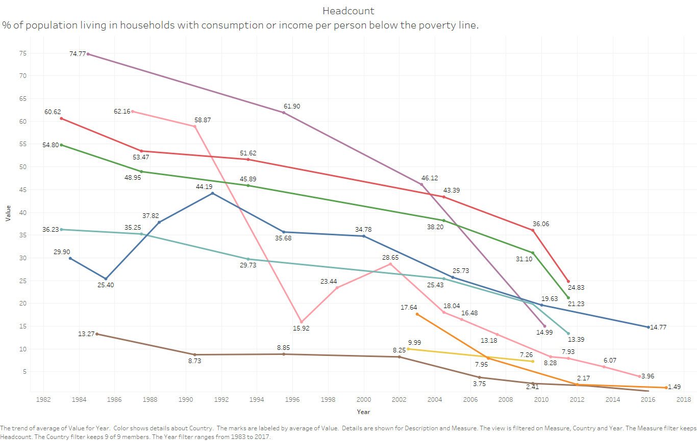

# Introduction to poverty measures in South Asia
***

```{r, echo=FALSE, warning=FALSE, error=FALSE, tidy=TRUE, cache=FALSE, message=FALSE}
library(sf)          # classes and functions for vector data
library(sp)          # classes and functions for vector data
library(raster)      # classes and functions for raster data
library(spData)      # load geographic data
library(spDataLarge)
library(ggplot2)
```

```{r, echo=FALSE, warning=FALSE, error=FALSE, tidy=TRUE, cache=FALSE}
world_asia = world[world$name_long == "Afghanistan" | world$name_long == "Bangladesh" |world$name_long == "Bhutan" | world$name_long == "India" |world$name_long == "Maldives" | world$name_long == "Nepal" |world$name_long == "Pakistan" | world$name_long == "Sri Lanka", ]
#plot(world_asia["name_long"],)
# plot(st_geometry(world_asia), expandBB = c(0, 0, 0, 0))
# https://github.com/Robinlovelace/geocompr/blob/master/code/chapters/02-spatial-data.R
```


According to the [Poverty and Shared Prosperity Report (2018)](http://www.worldbank.org/en/publication/poverty-and-shared-prosperity), the number of extreme poor in South Asia dropped to 216 million people in 2015, compared to half a billion in 1990, and Nigeria may already have overtaken India as the country with the most extreme poor in the world. Still, to achieve the [Sustainable Development Goals](https://www.un.org/sustainabledevelopment/poverty/), progress in poverty reduction needs to continue in India and the rest of South Asia. 

The latest poverty measures from the Poverty and Shared Prosperity Report (2018) are shown in Table \@ref(tab:pspr):

```{r pspr, echo=FALSE, warning=FALSE, eval=TRUE, error=FALSE, results='markup', tidy=TRUE, cache=FALSE}

pspr <- read_csv("./tables/pspr.csv",col_names = TRUE, col_types = cols())

# Table
knitr::kable(pspr,booktabs=TRUE, caption = 'Poverty Measures in Poverty and Shared Prosperity Report (2018)')

par(mfrow=c(1,2))

# Simple Pie Chart
slices <- unlist(pspr[1:5,4])
lbls <- unlist(pspr[1:5,1])
pie(slices, labels = lbls, main="Extreme poor by country")

# Simple Pie Chart
slices <- unlist(pspr[1:8,3])
lbls <- unlist(pspr[1:8,1])
pie(slices, labels = lbls, main="Population by country", font=1)

# ggplot
library(ggplot2)
# Barplot
bp<- ggplot(pspr, aes(x="", y=slices, fill=lbls))+
geom_bar(width = 1, stat = "identity")
pie <- bp + coord_polar("y", start=0)
```

Based on the [Poverty and Shared Prosperity Report (2018)](http://www.worldbank.org/en/publication/poverty-and-shared-prosperity), we can provide the following highlights:

> - In 2015, South Asia accounted for 29% of the people living in extreme poverty worldwide (216 million extreme poor in South Asia out of the estimated 736 million extreme poor worldwide). 
> - Four out of five extreme poor in the South Asia region reside in India. Despite a poverty rate of 13.42 percent, India’s large population of 1.3 billion results in a high absolute number of poor (approximately 176 million poor people in 2015). 
- Bangladesh has made remarkable progress in reducing poverty, but its large population still maintains it in second place within the region in terms of absolute number of poor (24.4 million extreme poor in 2016). 
- The third place is Pakistan, which has a larger population than Bangladesh, but a smaller amount of extreme poor (9.9 million extreme poor in 2015). Pakistan has seen a consistent and significant decline in poverty over the 14 years from 2001 to 2015. 
- Bhutan and Sri Lanka are considered development success stories where extreme poverty has become rare, although a large share of the population subsists on slightly more than the extreme poverty line. In the Maldives, extreme poverty is nearly nonexistent according to the latest survey data.  
>

Even as much of the region leaves extreme poverty behind, poverty is becoming more entrenched and harder to root out in certain areas, particularly in countries burdened by violent conflict and weak institutions. Nepal experienced devastating earthquakes in 2015 and remains predominantly rural, with the highest share of labor force in agriculture (73%) in the region as of 2016. The Maldives were devastated by the 2004 tsunami while its tourism industry is seriously threatened by climate change. In the case of Afghanistan, poverty is increasing as violence continues to affect the security of livelihoods and economic activity in the country. 

The World Bank’s poverty measures for South Asia provided by [PovcalNet](http://iresearch.worldbank.org/PovcalNet/home.aspx) are described in Table \@ref(tab:povcalnet) and may be accessed by interacting with the following figure:

[](https://tab.worldbank.org/#/site/WBG/views/SAR_MNA_Poverty/PovcalNet "The user may interact with this Tableau dashboard by clicking on the figure.")

```{r povcalnet, echo=FALSE, warning=FALSE, eval=TRUE, error=FALSE, results='markup', tidy=TRUE, cache=FALSE}
library(readr)
povcalnet <- read_csv("./tables/povcalnet.csv",col_names = TRUE, col_types = cols())
knitr::kable(povcalnet,booktabs=TRUE, caption = 'Poverty Measures in PovcalNet')
```

