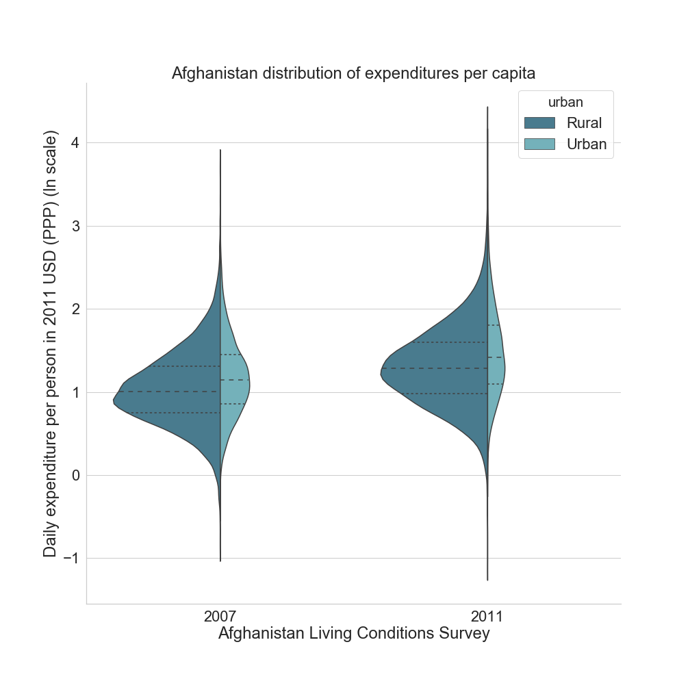
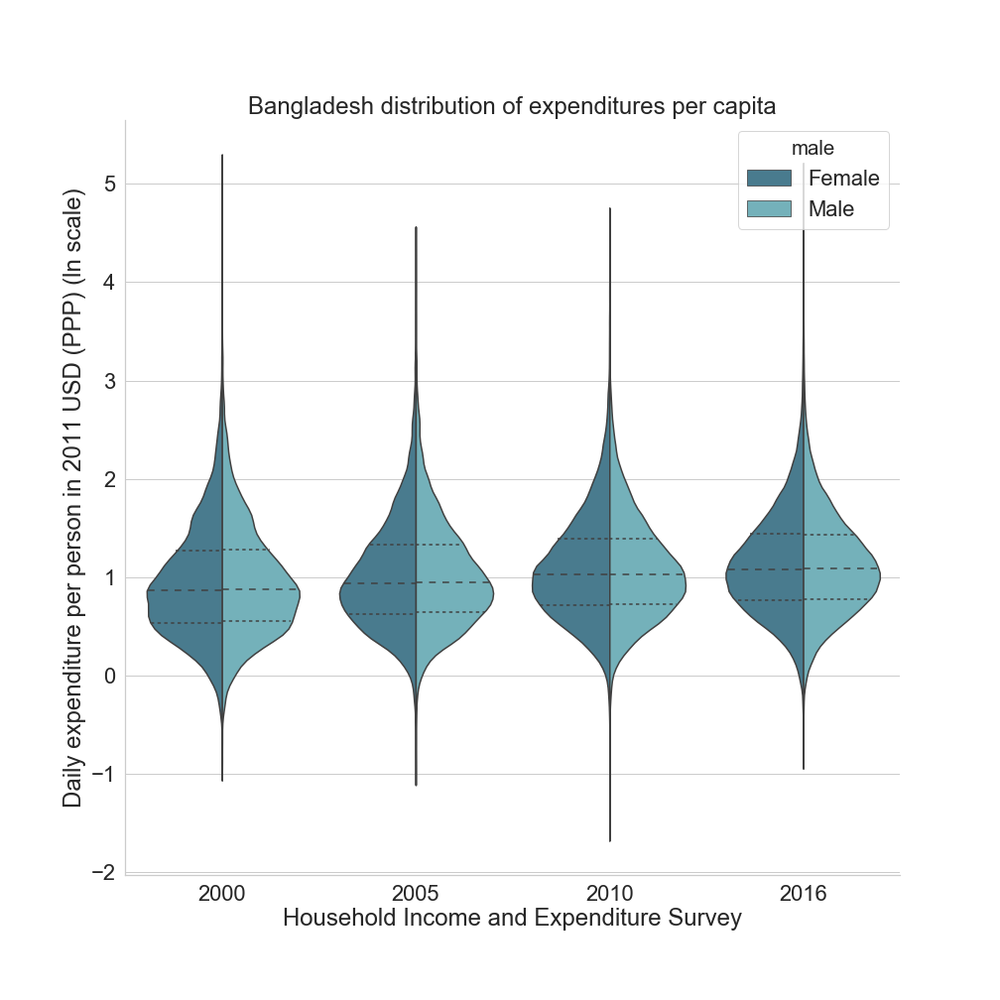
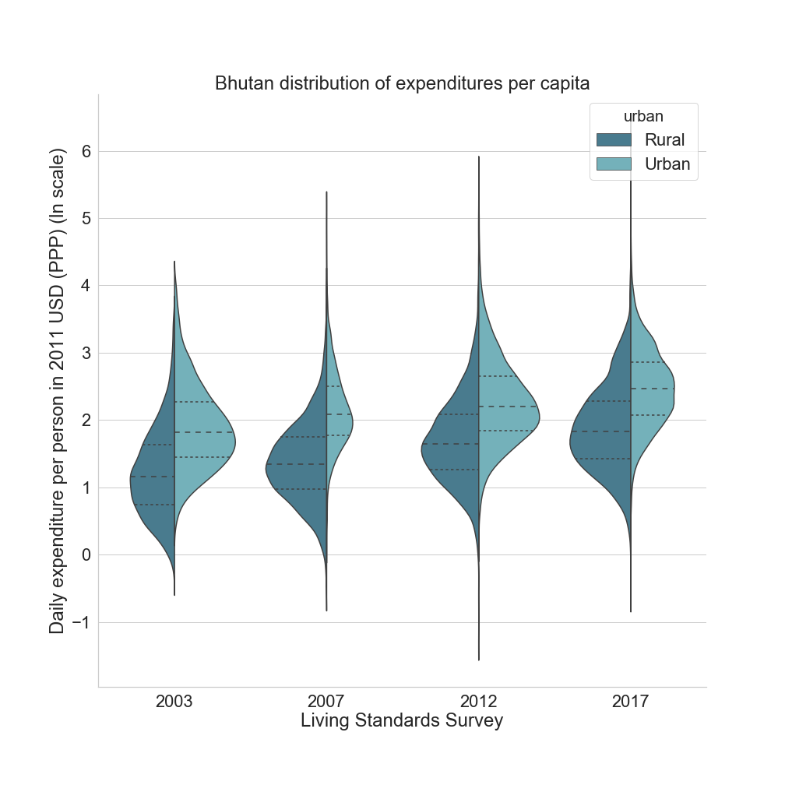
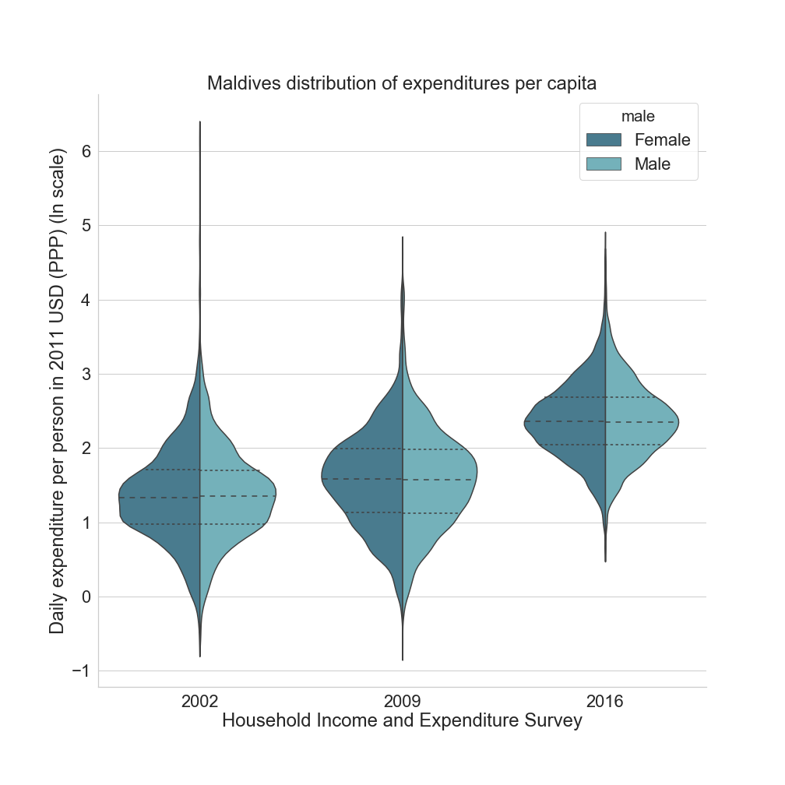
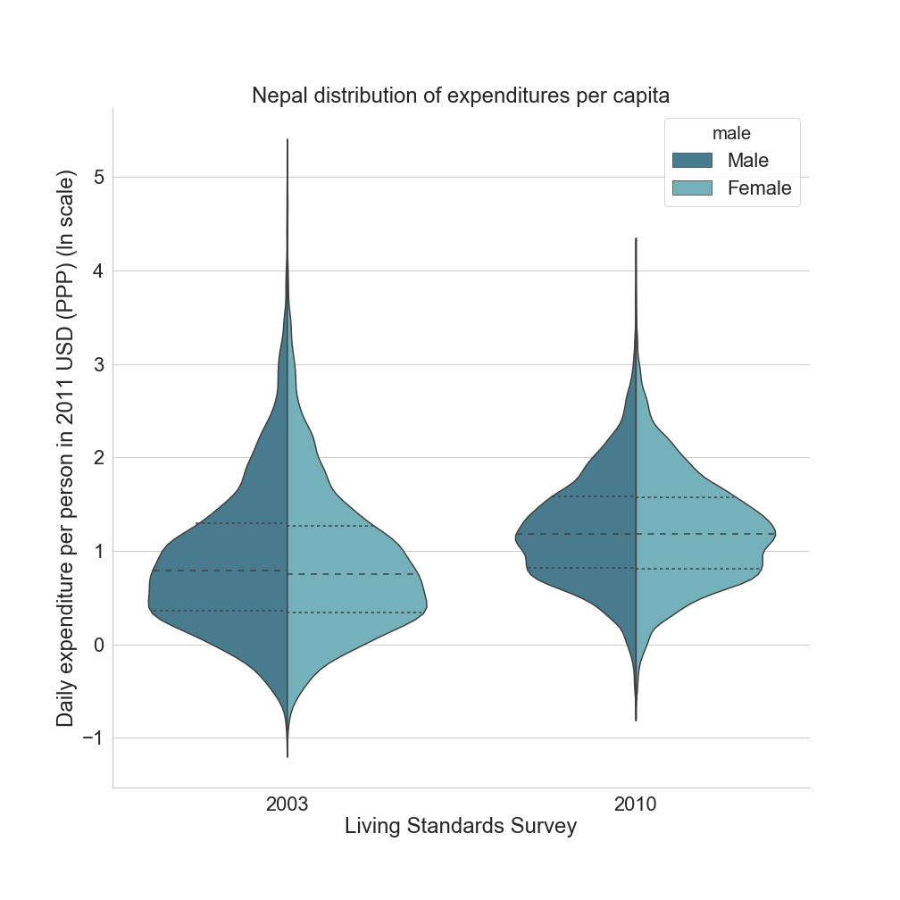
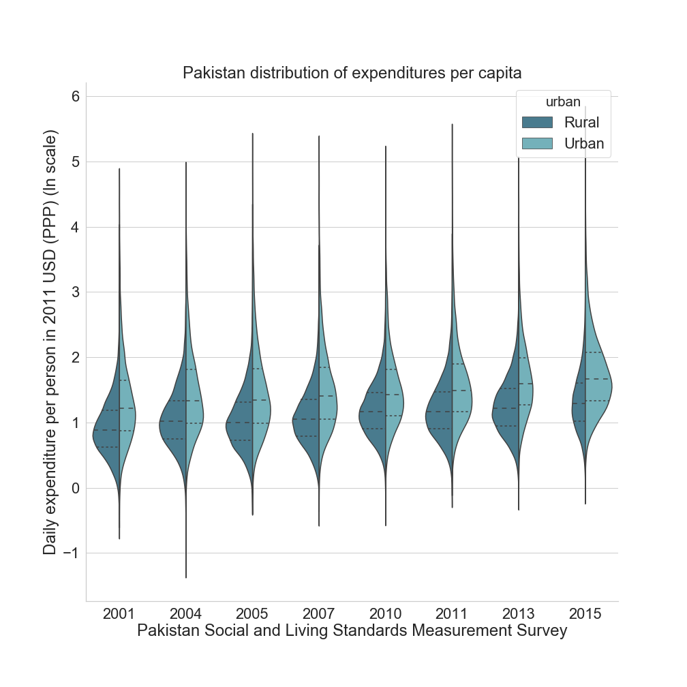
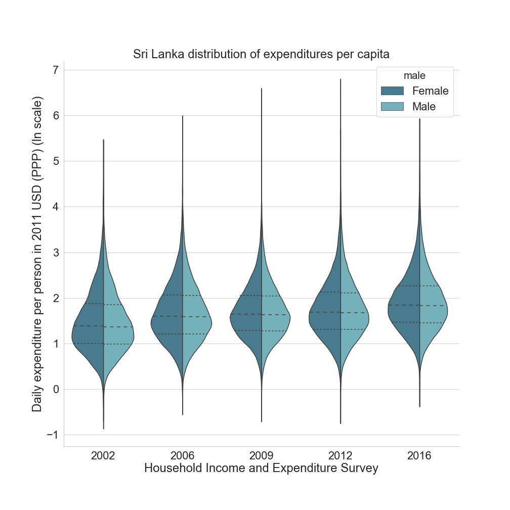
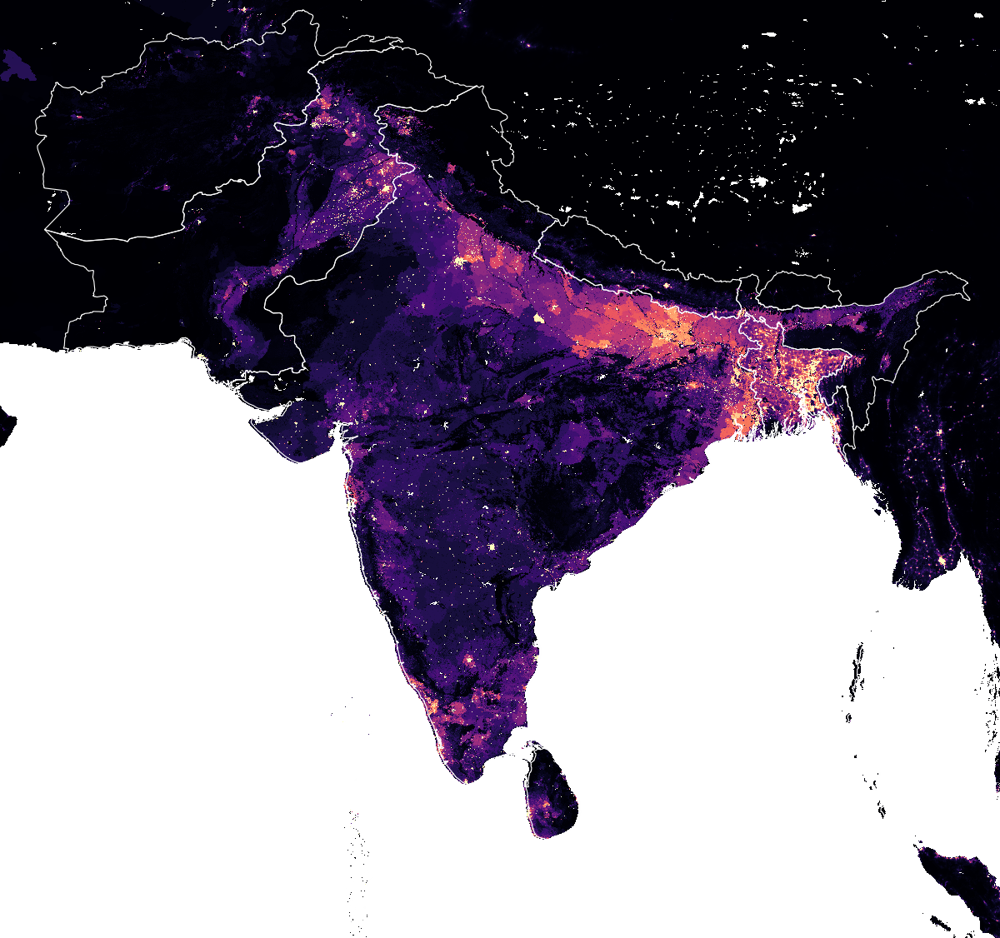

# Understanding poverty through household and individual level characteristics
***
> **Abstract:** 
>
> We apply multivariate regression modeling to identify key characteristics of poor households. In the linear regression model, the dependent variable is the value of expenditures per capita divided by the $1.90 poverty line. In the logit model, the dependent variable is binary and indicates whether the household is poor or not. 

Regression analysis is commonly undertaken to identify the effects of different characteristics on expenditures per capita. Some of these characteristics may include independent variables at the individual (age, gender, marital status), household (household size, housing, access to assets), community (urban/rural), and regional (state/province) levels. These variables have been harmonized in SARMD. For example, the  characteristics of the household head, such as `age`, `educy`, and `male`, may be identified using `relationharm==1` or `relationcs==1`. 

In this chapter, we provide a template for any user attempting to explain the levels of expenditure per capita (the dependent variable) as a function of a variety of harmonized independent variables contained in SARMD. In the linear regression model, the dependent variable is the value of expenditures per capita divided by the $1.90 poverty line. In the logit model, the dependent variable is binary and indicates whether the household is poor or not. 

A typical analysis of expenditures per capita may look something like this:

$$
\begin{equation} 
  \ln \left( \frac{y_{i}}{1.90} \right) = \beta_{0} +\beta_1 X_{i}+\beta_2 Z_{i}+\varepsilon _{i}
\end{equation} 
$$

The equation is said to be in the semi-log form because only the dependent variable is in logarithm. The coefficients in the semi-log model are partial or semi-elasticities. The model assumes a linear relationship between $\ln (y_{i}/1.90)$, $X_{i}$, and $Z_{i}$, where $X_{i}$ are independent variables for household head $i$ and $Z_{i}$ are independent variables for household $i$. The $\beta$'s are the coefficients we are trying to estimate. $\varepsilon _{i}$ represents a normally-distributed random error term. 

The regression analysis of a binary variable determines what is the probability of one outcome rather than an alternative outcome, in this case, falling below the poverty line or not. Logistic regression, also called a logit model, is used to model dichotomous outcome variables. In the logit model the log odds of the outcome is modeled as a linear combination of the predictor variables.

A two-step sample design, first selecting clusters and then households, generates a sample in which households are not randomly distributed over space. One complication of clustering is that the error term is correlated within cluster. Interviewing several households on a same block reduces survey costs, but may also lead to data being influenced by common unobserved cluster-specific characteristics. Surveys are also commonly designed to generate statistics for population subgroups defined by geographical area or ethnicity. Stratification guarantees there will be enough observations to permit estimates for each of these groups. @deaton provides an example. Suppose we know average rural income is lower than average urban income. A stratified survey would be two identical surveys, one rural and one urban, each of which would estimate average income. The average income for the whole country would be calculated by weighting together the urban and rural means using the proportion of the population in each group as weights. 

Unfortunately, `psu` and `strata` are not always available in SARMD. 


```stata
gen ln_welfare_perc=ln(welfare/cpi/ppp/365*12/1.90)
gen age_squared=age^2
local controls "age age_squared i.male hsize educy i.educat7 i.literacy \\
  i.marital i.urban i. electricity i.ownhouse i.subnatid1"
sum `controls' if relationharm==1 [aw=pop_wgt]
eststo: reg ln_welfare_perc `controls' if relationharm==1 [aw=pop_wgt]
esttab
```

```{r shcregtable, echo=FALSE, warning=FALSE, eval=TRUE, error=FALSE, results='markup', tidy=TRUE, cache=FALSE}
latest <- read_csv("./tables/regression table.csv",col_names = TRUE, col_types = cols())
knitr::kable(latest,booktabs=TRUE, caption = 'Latest household surveys available in SARMD')
```

## Afghanistan    {-}



## Bangladesh     {-}



## Bhutan         {-}



## India          {-}


## Maldives       {-}



## Nepal          {-}



## Pakistan       {-}



## Sri Lanka      {-}




```{r worldpop, out.width='100%', fig.asp=1, echo=FALSE, warning=FALSE, eval=FALSE, error=FALSE, results='markup', tidy=TRUE, cache=FALSE, fig.cap='South Asia Population Estimates from [WorldPop](https://www.worldpop.org/)', fig.align='center'}

```

