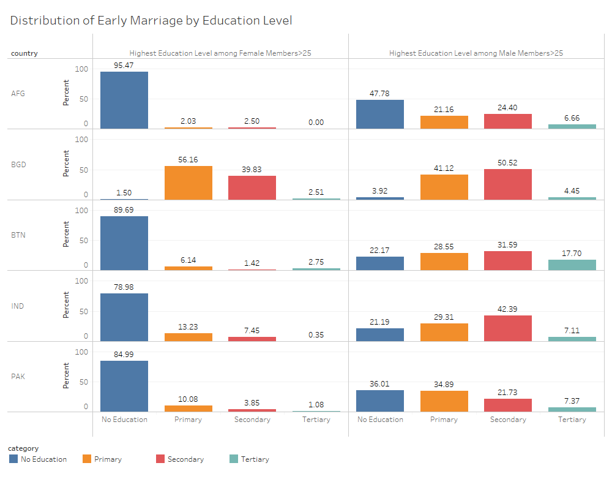

# Marital Status

## Child Marriage in SAR {-}
***

Child Marriage refers to formal marriages and informal unions of a girl or boy before the age of 18. Child marriage affects both girls and boys, but it mostly occurs among girls especially in South Asia.

South Asia has the highest rates of child marriage in the world. India and Bangladesh belong to top 10 countries with highest rate of child marriage. Almost half of all women aged 20-24 years reported being married before the age of 18. 

Based on relevant demographic variables including martial status, age, and relationship to head, proxy for child marriage is created using the following code. 

```stata
* Example: Creating a variable for early/child marriage

* Open dataset
datalibweb, country(`country') year(`year') type(SARMD) surveyid(`surveyid') clear 

* Generate child marriage
gen earlym=(age<18&male==0&marital!=2&marital!=.)
replace earlym=. if marital==.

gen child=age if relationharm==3
bys countrycode year idh: egen childage=max(child)
 
gen earlym_all=((age==20&male==0&relationharm<3&childage>1)|	///
				(age==21&male==0&relationharm<3&childage>2)|	///
				(age==23&male==0&relationharm<3&childage>3)|	///
				(age==24&male==0&relationharm<3&childage>4))|	///
				earlym==1
```

-distribution of child marriage share

```{r earlymarriage, fig.cap='Early Marriage and Education Level of HH Members', out.width='80%', fig.asp=.75, fig.align='center', echo=FALSE, warning=FALSE}

```

-education and early marriage 
female members education highly correlated with the incidence of child marriage.
the education level among men rather increased the incidence of early child marriage. 


