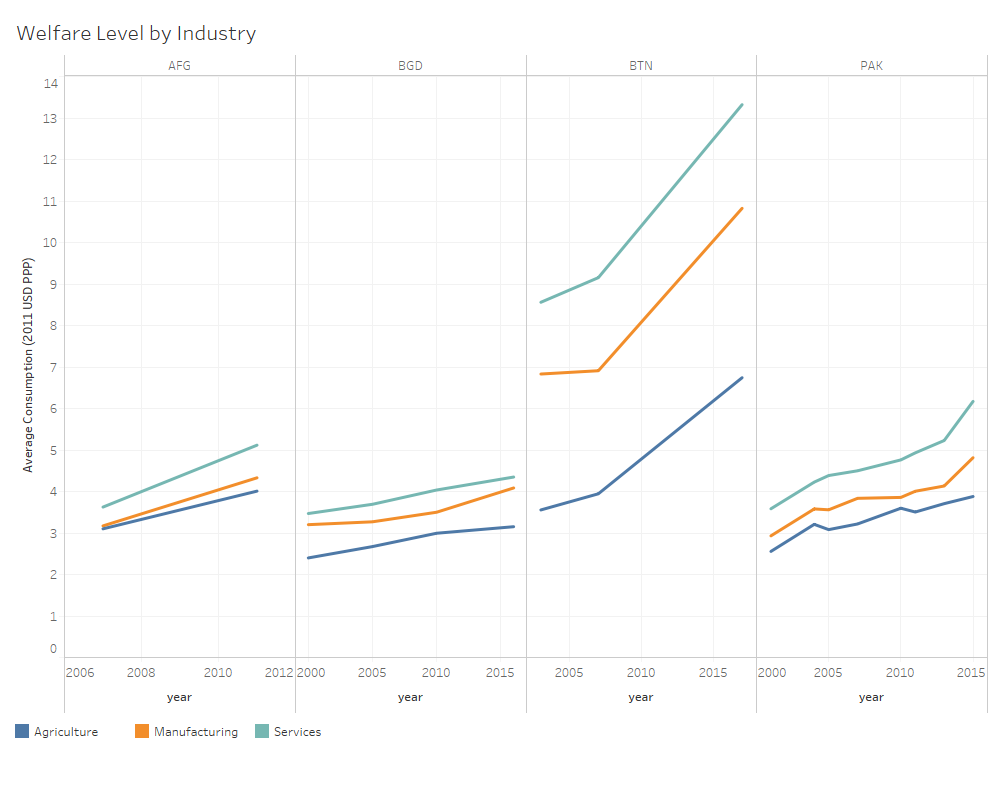

# Welfare level and employment by industry over time {#note-industry}
***

Welfare improvement can be disaggregated by industry to identify which sector favors high income earners. Countries including Bangladesh, Bhutan, and Pakistan have consistent labor market indicators and welfare aggregates, allowing for analyzing the trend and important features in labor markets. Figure below shows that the service sector, followed by manufacturing and agriculture, pays higher income and thus lead to more consumption. The gap of average welfare between service and agriculture becomes larger over time in three countries. In Bhutan and Pakistan, the welfare aggregate in service industry doubles than that in agriculture, implying the source of inequality. 

```{r labor1, fig.cap='Welfare by Industry over time', out.width='80%', fig.asp=.75, fig.align='center', echo=FALSE, warning=FALSE}

```

In order to investigate such gap, the share of employment by industry can be compared at different welfare levels. Households in the bottom quintile mostly rely on agriculture whereas rich households are employed in the service sector. In Bhutan, even though the share of employment in agriculture has decreased gradually, majority of poor households (about 90 percent of households in the bottom quintile) belong to agriculture and more than 40 percent of the richest households earn their income from service industry. 

Despite such difference in the industry compositon among poor and rich households, structural change in industry has consistently occurred in all three coutries especially among top 20 groups. The share of agriculture declined over time in both groups, but the magnitude of this decline becomes smaller in recent years. Pakistan is an exception where the share of agriculture employment among poor households increases from 44.7 percent in 2010 to 58.2 percent in 2015. 

The employment share in the manufacturing sector increased modestly in Bhutan and Pakistan, but a large increase occurred in the service sector. In Bangladesh, however, due to a sharp growth in garment industry, the percent of employment in manufacturing has risen up to 24 percent and 31.4 percet in bottom 20 and top 20 groups. 

<script type='text/javascript' src='https://tab.worldbank.org/javascripts/api/viz_v1.js'></script><div class='tableauPlaceholder' style='width: 700px; height: 827px;'><object class='tableauViz' width='700' height='827' style='display:none;'><param name='host_url' value='https%3A%2F%2Ftab.worldbank.org%2F' /> <param name='embed_code_version' value='3' /> <param name='site_root' value='&#47;t&#47;WBG' /><param name='name' value='SAR_MNA_NoteE&#47;q1_q5' /><param name='tabs' value='no' /><param name='toolbar' value='yes' /><param name='showAppBanner' value='false' /><param name='filter' value='iframeSizedToWindow=true' /></object></div>

```{r NoteEdash1,  echo=FALSE, fig.cap = "Employment by Industry and Year", out.height='10%', fig.align = 'left'}
knitr::include_graphics("figures/fake_figure.PNG")
```

Overall, the trends in employment share among different quintile groups emphasizes the growth of service sector in the region. Many development and trade economists argue that globalization may lead developing countries to more specialize in either primary or secondary industry including agriculture. However, unlike the expectation, those countries undergo the industrial change that favors the service sector. 

On the other side, the prevalence in agriculture employment in the bottom quintile group implies the importance of improvement in productivity in the agriculture sector. Compared to service and manufacturing industry, welfare has not been largely improved among agriculture workers. Given that the majority of poor households come from agriculture, policies of increasing producticity in agriculture will help reducing poverty in the region. 

<script type='text/javascript' src='https://tab.worldbank.org/javascripts/api/viz_v1.js'></script><div class='tableauPlaceholder' style='width: 700px; height: 827px;'><object class='tableauViz' width='700' height='827' style='display:none;'><param name='host_url' value='https%3A%2F%2Ftab.worldbank.org%2F' /> <param name='embed_code_version' value='3' /> <param name='site_root' value='&#47;t&#47;WBG' /><param name='name' value='SAR_MNA_NoteE&#47;All' /><param name='tabs' value='no' /><param name='toolbar' value='yes' /><param name='showAppBanner' value='false' /><param name='filter' value='iframeSizedToWindow=true' /></object></div>

```{r NoteEdash2,  echo=FALSE, fig.cap = "Employment by Industry and Year", out.height='10%', fig.align = 'left'}
knitr::include_graphics("figures/fake_figure.PNG")
```
You may access our full Stata do-file by accessing the following [link](https://github.com/randrescastaneda/SARMD_guidelines/blob/master/shareable_dofiles/labormarket.do). Our work consists of running the following command for each dataset and saving the results in order to export to Tableau. 

