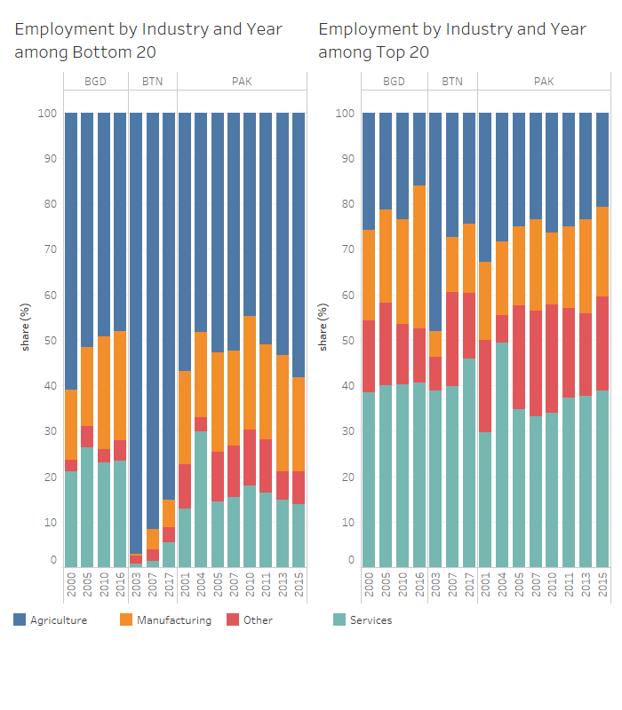

# Employment 

## Welfare and Industry {-}
***

```{r labor1, fig.cap='Welfare by Industry over time', out.width='80%', fig.asp=.75, fig.align='center', echo=FALSE, warning=FALSE}
knitr::include_graphics("./findings/Labor Market/welfare_ind.png")
```

```{r labor2, fig.cap='Welfare by Industry over time', out.width='80%', fig.asp=.75, fig.align='center', echo=FALSE, warning=FALSE}

```

