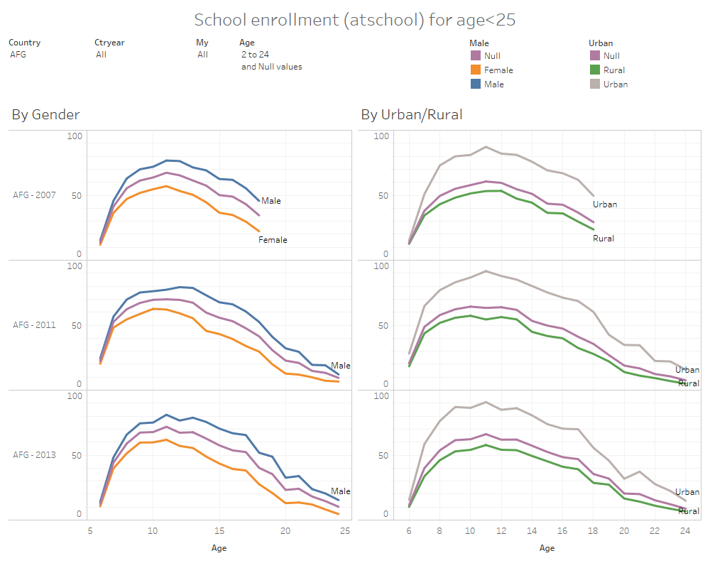
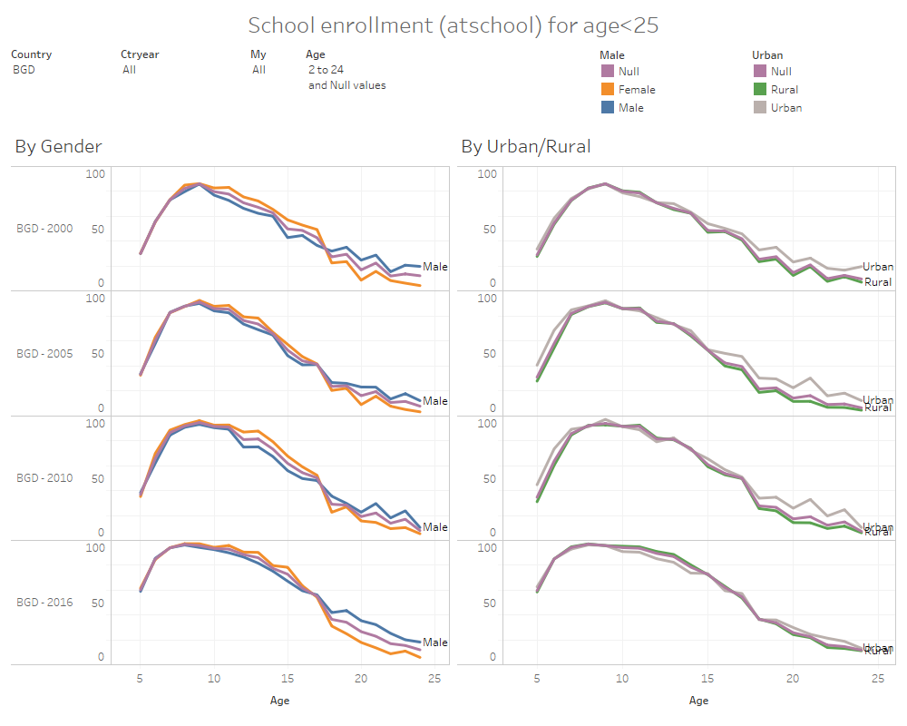
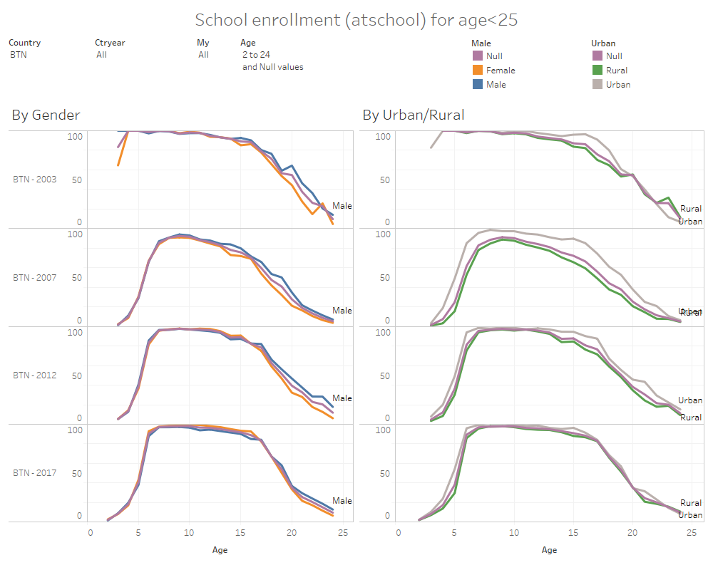
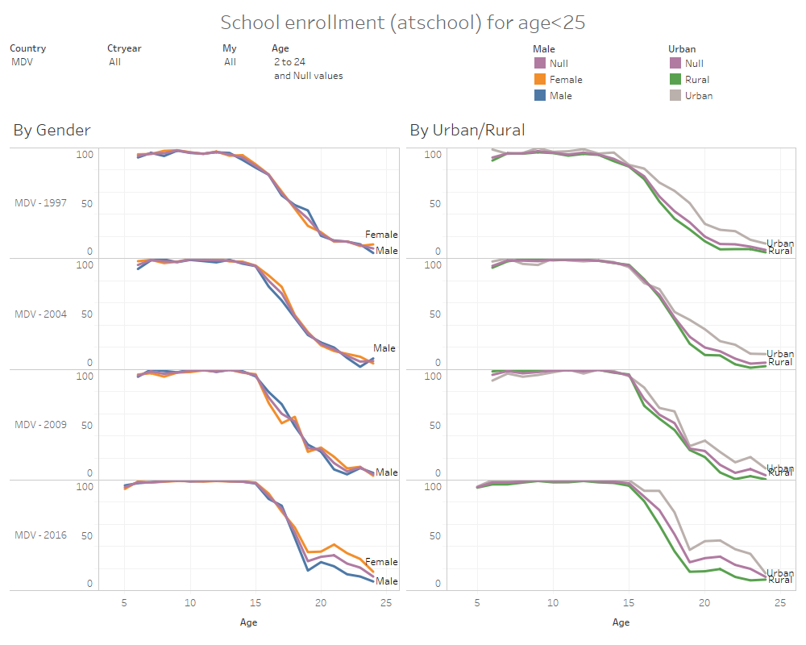
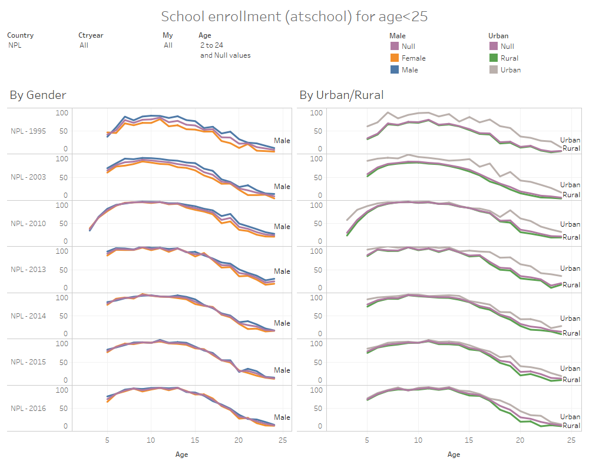
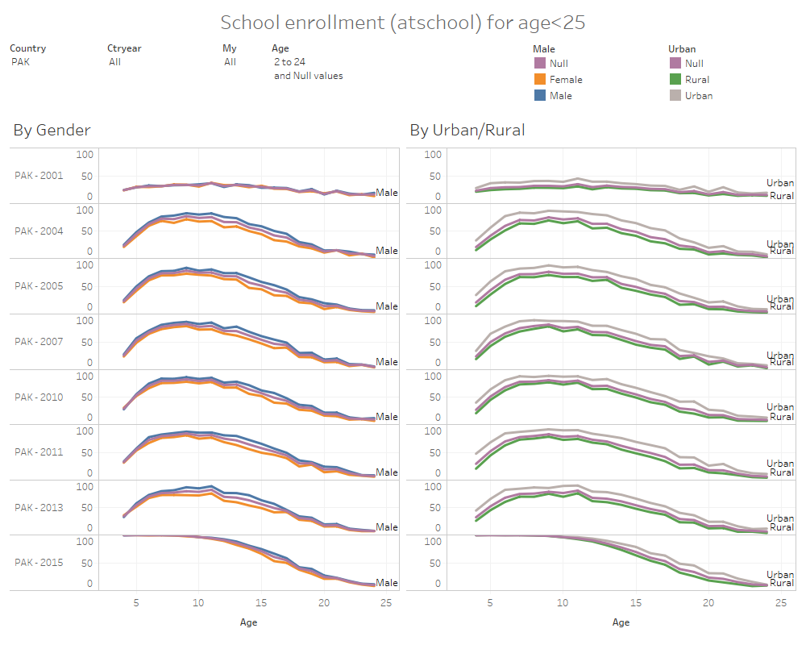
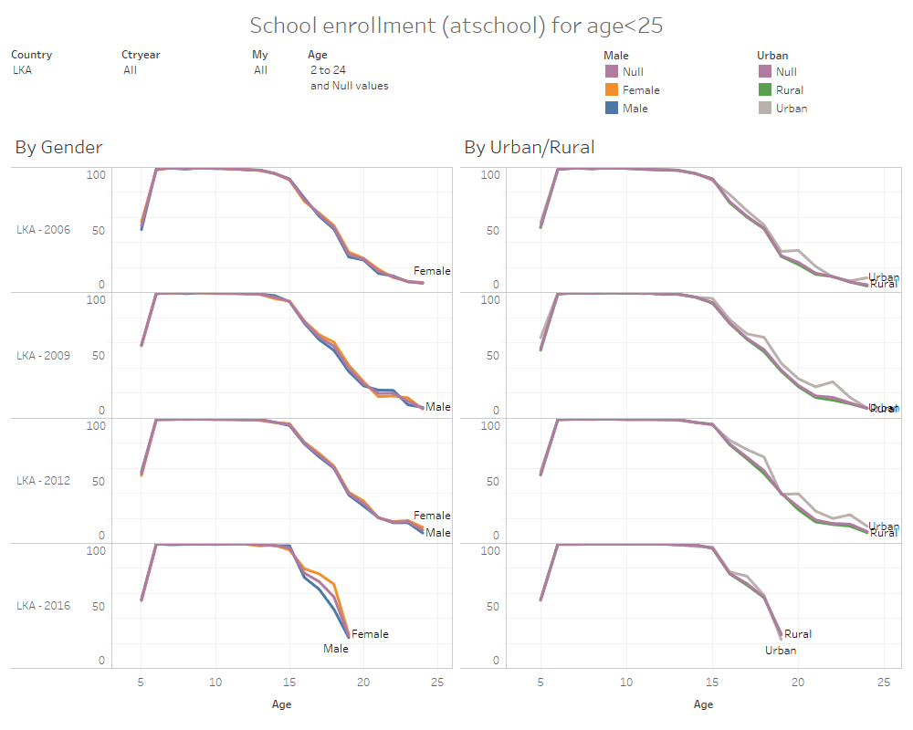

# Welfare and access to durable assets in South Asia

***
> **Abstract:** 
>
> Economic inequality may cover a wide variety of topics, most commonly, the distribution of income, expenditures, and wealth. In this analysis, we study the unequal distribution of durable assets between different groups in South Asia. We find that the cumulative percentage of access to assets by expenditures per capita rarely behaves as a flat line, which means distribution of access to assets is unequal. For most assets, including energy-using assets such as refrigerators and televisions, we see a positive relationship between access and expenditures per capita. In contrast, it is also possible for assets (for example, bicycles) to become less accessible as households become richer, suggesting they may have the characteristics of inferior goods. We find access to most assets has increased rapidly, although unevenly for different levels of welfare. A few exceptions are assets that may be becoming obsolete, such as radios and land phones, for which access has decreased over time across the region for all levels of welfare. 

Energy-using appliances, such as refrigerators, are taken for granted among households in developed countries. However, in South Asia these assets are still scarce and owning a refrigerator, for example, can have important consequences on the well-being of a family. Refrigerators may be common in urban areas of New Delhi, but they are almost non-existent in central Afghanistan. We study how asset ownership increases with welfare with the help of harmonized data from SARMD. The possession of valuable assets that facilitate family labor in a meaningful way are quick indicators of household purchasing power and economic development in the region. 

In microeconomics, an Engel curve describes how household expenditure on a good or service varies with household's purchasing power. For normal goods, the Engel curve has a positive gradient. That is, as purchasing power increases, the quantity of assets demanded increases. For inferior goods, the Engel curve has a negative gradient. 

```{r cpi, echo=FALSE, warning=FALSE, eval=TRUE, error=FALSE, results='markup', tidy=TRUE, cache=FALSE,  fig.cap="Engel curves for normal goods"}
library(readr)
engel <- read_csv("./tables/engel.csv",col_names = TRUE, col_types = cols())
library(ggplot2)
ggplot(data=engel, aes(x=Wealth, y=Quantity))  +   geom_line(aes(linetype=types))
```

The harmonized asset variables in SARMD indicate, not the quantity demanded, but whether households have access to assets. For example: 

| Variable	    | Description                     	                |
|-------------	|-------------------------------------------------	|
| `bicycle`     | Household has access to a bicycle  (1 = Yes 0 = No)   | 
| `cellphone`	  | Household has access to a cellphone  (1 = Yes 0 = No) |
| `computer`    | Household has access to a computer  (1 = Yes 0 = No) |
| `landphone`    | Household has access to a landphone  (1 = Yes 0 = No) |
| `motorcar`    | Household has access to a motorcar  (1 = Yes 0 = No) |
| `motorcycle`    | Household has access to a motorcycle  (1 = Yes 0 = No) |
| `radio`    | Household has access to a radio  (1 = Yes 0 = No) |
| `refrigerator`    | Household has access to a refrigerator  (1 = Yes 0 = No) |
| `sewingmachine`	  | Household has access to a sewingmachine  (1 = Yes 0 = No) |
| `television`    | Household has access to a television  (1 = Yes 0 = No) |
| `washingmachine`    | Household has access to a washingmachine  (1 = Yes 0 = No) |

Therefore, we do not know the quantity of assets demanded by each household and we are not able to present an Engel curve as described above. However, we may calculate the percentage of households with access to the asset as shown in the following dashboard:

[](https://tab.worldbank.org/#/site/WBG/views/SAR_MNA_Summary/Assets "The user may interact with this Tableau dashboard by clicking on the figure.")

An estimated 368 million people live without electricity in their homes in South Asia, and even among those who have access, many do not own basic assets such as refrigerators, televisions, or washing machines. As more households currently living in poverty benefit from overall economic development, we would expect a considerable increase in households’ purchases of durable assets and energy use. @wolframm estimated that if one half of the households in India who do not own refrigerators were to buy one, annual nationwide electricity demand would rise by over 10 percent. 

The following dashboard shows how high access to a refrigerator may be in the Maldives, compared to the rest of the countries. The user may use the filters to display the same figure for a different durable asset. 

[](https://tab.worldbank.org/#/site/WBG/views/SAR_MNA_Summary/LineChart "The user may interact with this Tableau dashboard by clicking on the figure.")

We model the non-linear relationship between welfare and access to assets as in @fuchs. These authors provide a theoretical framework to characterize the effect of income growth on asset purchases when consumers face credit constraints. A non-linear Engel curve means that as income goes up from initially very low levels, credit-constrained households do not immediately become more likely to purchase energy-using assets. Households faced with credit constraints only become likely to purchase energy-using assets once their income passes a threshold level. 

In some cases, we have been able to find an S-shaped relationship between households' per capita expenditures and access to durable assets in the figures below. These figures show how unequal is the distribution of access to assets. A horizontal line would represent perfect equality in asset distribution, but that is rarely the case.  

[](https://tab.worldbank.org/#/site/WBG/views/SAR_MNA_access_to_assets/AssetsandWelfare "The user may interact with this Tableau dashboard by clicking on the figure.")


### Bicycle

A negative slope may suggest bicycles are an inferior good, that is, it is more common for poor households to have access to them. 

[](https://tab.worldbank.org/#/site/WBG/views/SAR_MNA_access_to_assets/AssetsandWelfare "The user may interact with this Tableau dashboard by clicking on the figure.")

### Cellphone

We see a quick increase in access to cellphones over time at all levels of welfare. 

[](https://tab.worldbank.org/#/site/WBG/views/SAR_MNA_access_to_assets/AssetsandWelfare "The user may interact with this Tableau dashboard by clicking on the figure.")

### Computer

Access to computers only increases at levels of welfare above the poverty lines. 

[](https://tab.worldbank.org/#/site/WBG/views/SAR_MNA_access_to_assets/AssetsandWelfare "The user may interact with this Tableau dashboard by clicking on the figure.")


### Electricity

Access to electricity is clearly lower for individuals below the 1.90 poverty line. 

[](https://tab.worldbank.org/#/site/WBG/views/SAR_MNA_access_to_assets/AssetsandWelfare "The user may interact with this Tableau dashboard by clicking on the figure.")


### Ever attend school

This variable is technically not an asset, but we decided to include in this analysis. We can see positive slopes in every country, that is, poorer individuals are more likely to answer they have never attended any school. 

[](https://tab.worldbank.org/#/site/WBG/views/SAR_MNA_access_to_assets/AssetsandWelfare "The user may interact with this Tableau dashboard by clicking on the figure.")

### Fan

Having access to a fan is clearly related to welfare. Richer individuals may afford this luxury and may also be the only ones with access to electricity to be able to use a fan. 

[](https://tab.worldbank.org/#/site/WBG/views/SAR_MNA_access_to_assets/AssetsandWelfare "The user may interact with this Tableau dashboard by clicking on the figure.")

### Land phone

Having access to a land phone is clearly becoming obsolete, especially compared to the levels of access to cellphone. 

[](https://tab.worldbank.org/#/site/WBG/views/SAR_MNA_access_to_assets/AssetsandWelfare "The user may interact with this Tableau dashboard by clicking on the figure.")


### Literacy

Literacy is increasing over time and still related to welfare. Illiteracy is clearly more common among the poorest individuals. 

[](https://tab.worldbank.org/#/site/WBG/views/SAR_MNA_access_to_assets/AssetsandWelfare "The user may interact with this Tableau dashboard by clicking on the figure.")

### Motorcar

Having access to a motorcar seems to be more common for rich individuals in Afghanistan and Bhutan. 

[](https://tab.worldbank.org/#/site/WBG/views/SAR_MNA_access_to_assets/AssetsandWelfare "The user may interact with this Tableau dashboard by clicking on the figure.")

### Motorcycle

Having access to a motorcycle is more common than having access to a motorcar. Having access to motorcycles has become more frequent over time, especially among richer individuals.  

[](https://tab.worldbank.org/#/site/WBG/views/SAR_MNA_access_to_assets/AssetsandWelfare "The user may interact with this Tableau dashboard by clicking on the figure.")


### Own house

Compared to other assets, most households own the house they live in. Renting is common only among richer households in urban areas. 

[](https://tab.worldbank.org/#/site/WBG/views/SAR_MNA_access_to_assets/AssetsandWelfare "The user may interact with this Tableau dashboard by clicking on the figure.")

### Piped water

Only Bhutan shows having almost universal access to piped water. 

[](https://tab.worldbank.org/#/site/WBG/views/SAR_MNA_access_to_assets/AssetsandWelfare "The user may interact with this Tableau dashboard by clicking on the figure.")


### Radio

Another good that may be becoming obsolete are radios, with less households reporting having access to a radio over time at all levels of welfare.  

[](https://tab.worldbank.org/#/site/WBG/views/SAR_MNA_access_to_assets/AssetsandWelfare "The user may interact with this Tableau dashboard by clicking on the figure.")


### Refrigerator

Having access to a refrigerator seems to be strongly related to welfare, with average access to it growing fast around the 3.2 poverty line. 

[](https://tab.worldbank.org/#/site/WBG/views/SAR_MNA_access_to_assets/AssetsandWelfare "The user may interact with this Tableau dashboard by clicking on the figure.")


### Sewage toilet

No country shows evidence of high access to sewage toilets. 

[](https://tab.worldbank.org/#/site/WBG/views/SAR_MNA_access_to_assets/AssetsandWelfare "The user may interact with this Tableau dashboard by clicking on the figure.")


### Sewing machine

Sewing machines seem to remain highly valuable in Afghanistan and Pakistan with more than 50% of individuals reporting having access to it. 

[](https://tab.worldbank.org/#/site/WBG/views/SAR_MNA_access_to_assets/AssetsandWelfare "The user may interact with this Tableau dashboard by clicking on the figure.")


### Television

Televisions are a highly-desirable durable asset and are clearly more common among richer households. Having access to a television depends on having access to electricity. Both electricity and television follow similar trends. 

[](https://tab.worldbank.org/#/site/WBG/views/SAR_MNA_access_to_assets/AssetsandWelfare "The user may interact with this Tableau dashboard by clicking on the figure.")


### Washing machine

Having access to a washing machine is clearly a luxury and only common among the wealthiest. 

[](https://tab.worldbank.org/#/site/WBG/views/SAR_MNA_access_to_assets/AssetsandWelfare "The user may interact with this Tableau dashboard by clicking on the figure.")


```{r, eval=FALSE, echo=FALSE}
https://tab.worldbank.org/#/site/WBG/views/Note1/Dashboard1

  plots the share of households that own refrigerators, televisions, and washing machines in India (2011) against household expenditure. 

An estimated 368 million people live without electricity in their homes in South Asia, and even among those who have access, many do not own basic assets such as refrigerators, televisions, or washing machines. We study household decisions to acquire assets in the presence of rising incomes. Table ?? demonstrates the low penetration that these energy-consuming assets have in South Asia.  

demostrates how for a group of several assets, asset ownership is high in the Maldives and lower in the rest of South Asia. 

Filmer and Pritchett, 2001, argue that the first principal component of the household’s ownership of physical assets is highly correlated with household expenditure and can be used as a reasonable proxy. 

```


# School enrollment in South Asia


> **Abstract:** 
>
> School enrollment over age has the shape of a pleateau (or trapezoid) in countries that have achieved almost universal primary education such as Maldives, Bhutan, and Sri Lanka. However, we find evidence of school enrollment having the shape of an inverted U in Afghanistan, Bangladesh, Nepal, and Pakistan, where dropout rates are still concerning even among primary school children aged 4 to 12 years.

Countries in South Asia (Afghanistan, Bangladesh, Bhutan, India, Maldives, Nepal, Pakistan, and Sri Lanka) have achieved different levels of progress regarding school enrollment. Sri Lanka achieved near-universal primary education decades ago, while Afghanistan and Pakistan still lag significantly behind other South Asian countries. In this analysis, we compare the education levels achieved across countries considering their different education systems. 

In recent years, South Asian countries have invested in school inputs and directed their efforts towards achieving universal access to primary
education. These investments have led to more children retained in school. According to @students_sar, enrollment in South Asia’s primary schools rose from 75.0 percent in 2000 to 89.0 percent in 2010, bringing it closer to that of the Latin America and the Caribbean (94.0 percent) and East Asia and the Pacific (94.8 percent) regions. Between 1999 and 2010, the number of out-of-school children ages 8–14 years fell from 35 million to 13 million, and the number of out-of-school girls in the region dropped by 59 percent.

[Sustainable Development Goal 4](https://www.un.org/sustainabledevelopment/education/) has ten targets encompassing many different aspects of education. The first target is to ensure that by 2030 all girls and boys complete free, equitable and quality primary and secondary education leading to relevant and effective learning outcomes. Equality in primary education between girls and boys has improved, but not at all levels of education. 

The South Asia Regional Micro Database (SARMD) contains the following harmonized variables at the individual level (when `age>=ed_mod_age`) to monitor progress towards the achievement of these goals:  

| Variable	    | Description                     	                |
|-------------	|-------------------------------------------------	|
| `ed_mod_age`| Age at which education module is applied	          | 
| `atschool`	| Individual attending school     (1 = Yes 0 = No)	  |
| `everattend`| Individual ever attended school (1 = Yes 0 = No)    | 
| `literacy`	| Individual can read and write   (1 = Yes 0 = No)	  |
| `educy`	    | Years of education	| 
| `educat4` 	| 1 = No education 2 = Primary (complete or incomplete) 3 = Secondary (complete or incomplete) 4 = Tertiary (complete or incomplete) 	| 
| `educat5` 	| 1 = No education 2 = Primary incomplete 3 = Primary complete but secondary incomplete 4 = Secondary complete 5 = Some tertiary  	| 
| `educat7` 	| 1 = No education 2 = Primary incomplete 3 = Primary complete 4 = Secondary incomplete 5 = Secondary complete 6 = Higher than secondary but not university 7 = University incomplete or complete | 

The most vulnerable group in terms of low literacy is women older than 65 years. Even among younger adults and children, the difference in literacy rates between men and women is wide. Figure \@ref(fig:literacy) allows you to display average literacy rates at a subnational level. Afghanistan has one of the lowest literacy rates in the world. In 2011, it was estimated at about 31% of the adult population (15 years or older).  

```{r literacy, echo=FALSE, warning=FALSE, eval=TRUE, error=FALSE, fig.cap='[Female Literacy Rate (15-65 years)](https://tab.worldbank.org/#/site/WBG/views/Note3/Literacy)', out.width='80%', fig.asp=.75, fig.align='center'}
knitr::include_graphics("./figures/Literacy.png")
```

Primary, secondary and tertiary education are defined differently in each country. Secondary education, in particular, has significantly different meanings across countries as shown in this [dashboard](https://tab.worldbank.org/#/site/WBG/views/SAR_MNAEducationbycategories/Frequency). In Bangladesh, the education system is divided into three levels: 

* Primary Level (Class 1–5). Students receive their Primary School Certificate at the end of 5th grade. 
* Secondary Level (6-10) or (9-12 at some schools). Students receive their Secondary School Certificate at the end of 10th grade (similar to India and Pakistan). This is equivalent to GCSE in England and the first two years of high school in the United States. There is no middle school system in Bangladesh. 
* Tertiary Level (University)

In contrast, Sri Lanka's education structure is divided into five parts: primary (kindergarden through grade 5), junior secondary (grades 6-9), senior secondary (grades 10-11), collegiate (grades 12-13), and tertiary (university). These differences in education systems mean that the relationships between `age`, `ed_mod_age`, `educy`, `educat4`, `educat5`, and `educat7` vary by country. The following table displays each country's most recent value for `ed_mod_age` and provides a summary for how primary, secondary and tertiary school have been harmonized in SARMD: 

```{r harmonizededuc, echo=FALSE, warning=FALSE, eval=FALSE, error=FALSE, results='markup', tidy=TRUE, cache=FALSE}
library(readr)
harmonized_educ <- read_csv("./tables/harmonized_educ.csv",col_names = TRUE, col_types = cols())
knitr::kable(harmonized_educ,booktabs=TRUE, caption = 'Harmonized education levels')
```

| Country     	| ed_mod_age 	| Primary (Grades) 	| Secondary (Grades) | Tertiary 	|
|-------------	|:-----------:|:---------:|:-----------:|:---------:|
| Afghanistan 	|      6     	|   1-6   	|    7-12   	|    13-   	|
| Bangladesh  	|      5     	|   1-5   	|    6-12   	|    13-   	|
| Bhutan      	|      2     	|   1-9   	|   10-12   	|    13-   	|
| India       	|      NA   	|   1-5   	|    6-12   	|    13-   	|
| Maldives    	|      5     	|   1-5   	|    6-12   	|    13-   	|
| Nepal       	|      5     	|   1-6   	|    7-12   	|    13-   	|
| Pakistan    	|      4     	|   1-8   	|    9-12   	|    13-   	|
| Sri Lanka   	|      5     	|   1-6   	|    7-12   	|    13-   	|

Our analysis of school enrollment of school-age children and young adults (`age<25`) consists of studying how `atschool` changes over time in each country depending on `male` and `urban`. It is easy to identify how Bhutan, Maldives and Sri Lanka have achieved near-universal primary education by looking at the shape of the figures in the following Tableau dashboards, while enrollment rates in Afghanistan, Bangladesh, Nepal, and Pakistan still have the shape of an inverted U. 

This analysis has provided the following findings:

### Afghanistan   

Afghanistan has one of the youngest populations in the world, making quality education particularly critical for the rapidly growing numbers of school aged boys and girls. Afghanistan has the widest gap between male/female and urban/rural enrollment rates. The education system is K–12, that is from kindergarten (K) for 4-6 year-olds through twelfth grade (12) for 17-19 year-olds. Long distance to school and reluctance to send children to school are by far the most common reasons for not starting school (mentioned for 37 and 25 percent of those who never attended school), whereas the need for child labor and perceived irrelevance of further education were the most important reasons for terminating education.

[](https://tab.worldbank.org/#/site/WBG/views/SAR_MNA_atschool/atschool "The user may interact with this Tableau dashboard by clicking on the figure.")

### Bangladesh    

In Bangladesh, all citizens must undertake twelve years of compulsory education which consists of eight years at the primary school level and six years at the high school level. Primary and secondary education is financed by the state and free of charge in public schools. Still, enrollment rates fall rapidly especially after age 9. Enrollment rates fall faster for male students than for female students until both lines intersect. At higher levels of education, female enrollment is lower than male enrollment. 

[](https://tab.worldbank.org/#/site/WBG/views/SAR_MNA_atschool/atschool "The user may interact with this Tableau dashboard by clicking on the figure.")

### Bhutan        

The following figures show how Bhutan has achieved nearly-universal primary education over time and how the male/female and urban/rural gaps have narrowed. In Bhutan, primary education is provided free for six years. Secondary education lasts six years and is divided into the lower, middle and higher secondary levels with a duration of two years each. 

[](https://tab.worldbank.org/#/site/WBG/views/SAR_MNA_atschool/atschool "The user may interact with this Tableau dashboard by clicking on the figure.")
 
### India         

Unfortunately, surveys from India do not collect enough information about individuals' general educational level to complete this analysis. 

### Maldives      

Our figures show how universal primary education has been achieved in Maldives. Still, a wide gap between male and female enrollment rates remains at higher levels of education.

[](https://tab.worldbank.org/#/site/WBG/views/SAR_MNA_atschool/atschool "The user may interact with this Tableau dashboard by clicking on the figure.")
 
### Nepal         

Primary education in Nepal consists of grades one through eight. Secondary education are grades nine and ten, and Higher Secondary Levels cover grades eleven and twelve. Pre-primary education is available in some areas, and students usually begin grade one at age six. A Basic Education Examination is given on grade eight. A national Secondary Education Exam examination is conducted at the end of grade 10. Completing grade 12 examination leads to the School Leaver's Certificate. However, it is clear from the figures that enrollment rates start to fall before reaching grade 12. 

[](https://tab.worldbank.org/#/site/WBG/views/SAR_MNA_atschool/atschool "The user may interact with this Tableau dashboard by clicking on the figure.")

### Pakistan      

In Pakistan, the gap between urban and rural enrollment rates is very clear. There also seems to be a great increase in enrollment of young children from 2013 to 2015. The education system in Pakistan is divided into six levels: preschool (for the age from 3 to 5 years), primary (grades one through five), middle (grades six through eight), high (grades nine and ten, leading to the Secondary School Certificate), intermediate (grades eleven and twelve, leading to a Higher Secondary School Certificate), and university programs leading to undergraduate and graduate degrees.

[](https://tab.worldbank.org/#/site/WBG/views/SAR_MNA_atschool/atschool "The user may interact with this Tableau dashboard by clicking on the figure.")

### Sri Lanka     

Sri Lanka's education structure is divided into five parts: primary, junior secondary, senior secondary, collegiate, and tertiary. Primary education lasts five to six years (Kindergarden through grade 5) and at the end of this period, the students may elect to write a national exam called the Scholarship exam. This exam allows students with exceptional skills to move on to better schools. After primary education, the junior secondary level (referred to as middle school in some schools) lasts for 4 years (Grades 6-9) followed by 2 years (Grades 10-11) of the senior secondary level which is the preparation for the General Certificate of Education (G.C.E) Ordinary Level (O/Ls). According to the Sri Lankan law, it is compulsory that all children go to school till grade 9 (age 14) at which point they can choose to continue their education or drop out and engage in apprenticeship for a job or farming. This is very clear in our figures where enrollment rates drop shortly after age 15. 

[](https://tab.worldbank.org/#/site/WBG/views/SAR_MNA_atschool/atschool "The user may interact with this Tableau dashboard by clicking on the figure.")

You may access our full Stata do-file by clicking the following [link](https://github.com/randrescastaneda/SARMD_guidelines/blob/master/shareable_dofiles/school_enrollment_by_age.do). Our work consists of running the following command for each dataset and saving the results in order to export to Tableau. 

```markdown
# Example: Measuring school enrollment by age, gender and urban/rural

# Open dataset
datalibweb, country(`country') year(`year') type(SARMD) surveyid(`surveyid') clear 

# Generate enrollment rates 
mean atschool [aw=wgt] if age < 25, over(age male urban) // same as anova
anova atschool i.age##i.male##i.urban  [aw=wgt] if (age < 25) 
		
tempfile g u gu a
margins i.age##i.male         [aw=wgt] if (age < 25), saving(`g')
margins i.age##i.urban        [aw=wgt] if (age < 25), saving(`u')

# Plot figure		
combomarginsplot  `u' `g', noci recast(line) legend(cols(2) position(6)) /* 
		 */ plotopts(lpattern(l)) by(_filenumber) labels("Urban/rural" "Gender")
```


## Understanding poverty through household and individual level characteristics

Regression analysis is commonly undertaken to identify the effects of different characteristics on expenditures per capita. Some of these characteristics may include a household's location, the age, education, and gender of the household head, and household size. These characteristics may be classified at the individual (age, gender, marital status), household (housing, access to assets), community (urban/rural), and regional (state/province) levels. 

In this section, we provide a template for any user attempting to explain the levels of expenditure per capita (the dependent variable) as a function of a variety of harmonized independent variables contained in SARMD. A typical analysis of expenditures per capita may look something like this:

Equation 1

$$f\left(k\right)=\binom{n}{k}p^k\left(1-p\right)^{n-k}$$

$$

\begin{equation} 
  \ln (\frac{y_{i)}}{1.90}) = \beta_{0} +\beta X_{i}+\varepsilon _{i}
\end{equation} 

$$

where $X_{i}$ are the independent variables for household $i$ and $\beta$ are the coefficients we are tring to estimate. 

```markdown
gen ln_welfare_perc=ln(welfare/cpi/ppp/365*12/1.90)
gen age_squared=age^2
local controls "age age_squared i.male hsize educy i.educat7 i.literacy \\
  i.marital i.urban i. electricity i.ownhouse i.subnatid1"
sum `controls' if relationharm==1 [aw=pop_wgt]
eststo: reg ln_welfare_perc `controls' if relationharm==1 [aw=pop_wgt]
esttab
```
```{r latest, echo=FALSE, warning=FALSE, eval=TRUE, error=FALSE, results='markup', tidy=TRUE, cache=FALSE}
library(readr)
latest <- read_csv("./tables/regression table.csv",col_names = TRUE, col_types = cols())
knitr::kable(latest,booktabs=TRUE, caption = 'Latest household surveys available in SARMD')
```


## WorldPop


```{r worldpop, out.width='100%', fig.asp=1, echo=FALSE, warning=FALSE, eval=TRUE, error=FALSE, results='markup', tidy=TRUE, cache=FALSE, fig.cap='South Asia Population Estimates from [WorldPop](https://www.worldpop.org/)', fig.align='center'}
knitr::include_graphics("./figures/map_asia_2020_morado.png")
```


