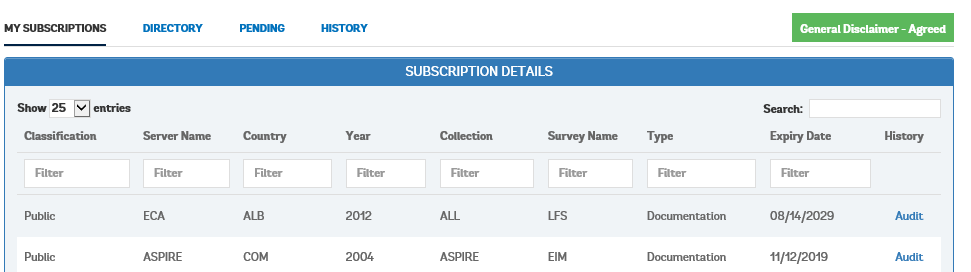
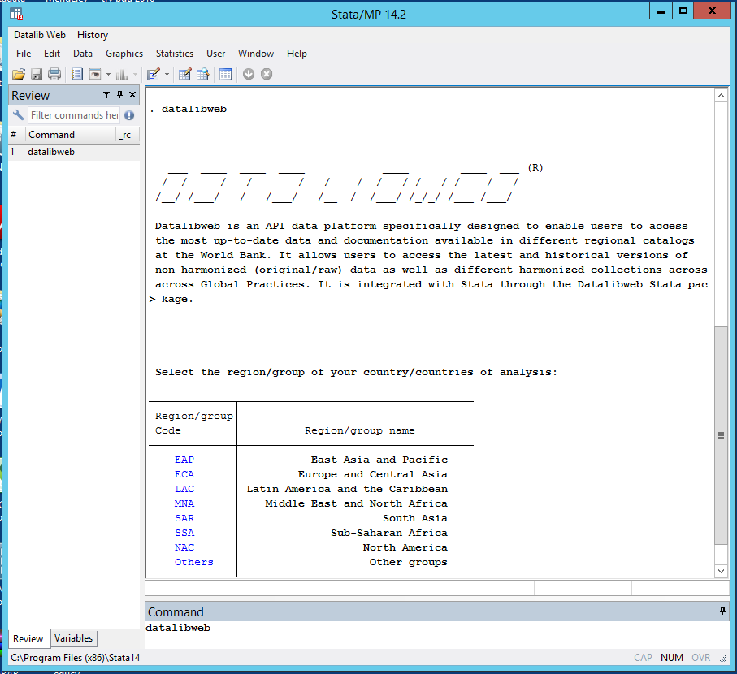

# Datalibweb: Getting Access to SARMD
***
>This chapter is mainly composed by Joan Van Ommeren, Melissa  Cockrell, Victoria Harper, and Minh Cong Nguyen. Please refer to the [Datalibweb Terms of Use](#datalibweb-tou) in the appendix of this book for a clear understanding of your responsabilities as a `datalibweb` user. 

## SARMD in `Datalibweb`

```{r, echo=FALSE, out.width = '40%', out.extra='style="float:right; padding:10px"'}

```

SARMD is exclusively available through the [datalibweb](http://globalpractices.worldbank.org/teamsites/Poverty/GPDP/SitePages/datalibweb.aspx) system to guarantee replicability, security, and efficiency. `Datalibweb` is a data system specifically designed to enable users to access the most up-to-date versions of non-harmonized (original raw data) and harmonized datasets of different collections across Global Practices. SARMD is one collection among other collections available through `datalibweb`. This section provides reference to the documentation provided by the [Global Team for Statistical Development](http://globalpractices.worldbank.org/teamsites/Poverty/GPDP/SitePages/Main.aspx) (GTSD) in the Poverty and Equity Global Practice.

Using the datalibweb system has several advantages:

* Instant access to raw and harmonized surveys ready to use for country or regional level analysis
* Automatically generated time-deflated variables and poverty lines
* User friendly interactive interface  in Stata
* A suitable Stata command for replicability, research, and programing purposes
* Ability to combine different country surveys and survey years
* Merging raw data and modules of harmonized collections on the fly (option in progress)


## Introduction
Datalibweb is an API data platform designed to enable users to access the most up-to-date data and documentation available in the World Bank. It allows users to access current and historical versions of raw, non-harmonized data as well as different harmonized collections across Global Practices. It is integrated with Stata through the Datalibweb/Stata package. 

Datalibweb facilitates fast and reliable access to micro data to be used in analysis relevant to the World Bank’s twin goals of ending extreme poverty and promoting shared prosperity. The use of Datalibweb also ensures replicability of the analysis conducted. 

User subscription and access to the data follows country-specific terms of use. All usage of the data is recorded in the system for auditing purposes and is relayed back to the country and regional teams.

## Purpose of user guide
This guide provides an overview of Datalibweb features and how to use them. The following details are included:

* How to register an account with the site 
* How to view and subscribe to data
* How to sign disclaimers and approve or reject data requests
* How to add/remove files from cart
* How to view subscription history
* How to classify surveys as public/private and hide them from the master list
* How to assign a Country Team Task Lead (TTL) to the survey
* How to assign a memorandum of understanding (MOU) to the survey
* How to add a new MOU

## Instructions for use

### Registration
All users must register with the site to see the data. 

1.	Type [INSERT URL] into the browser.
2.	Enter requested information (if not pre-populated).
```{r dlw_registration, echo=FALSE, fig.cap = "Datalibweb Registration"}
knitr::include_graphics("figures/dlw_registration.png")
```
3. "Intended Use" section is manditory and must be completed with description of intended use of the data
4. Check the checkbox agreeing to the terms and conditions.  
5. Click “Register”

After the user registers, they will see a minimum of four tabs. The tabs are:

* My Subscriptions
* Directory
* Pending
* History

If the user is designated as a Collection Admin or Super Admin, they will see two additional tabs: 

* Public/Licensed
* Country TTL and MOU

### My Subscriptions Tab
In the My Subscriptions tab, user subscriptions are displayed. 
Subscriptions can be sorted by:

* Classification
* Server Name
* Country
* Year
* Collection
* Survey Name
* Type
```{r dlw_subscription, echo=FALSE, fig.cap = "Datalibweb Registration"}

```

### Directory Tab


## Request access to the system
Unlike GMD, access to regional harmonized collections like SARMD or to the original raw datasets is not given to users automatically. Most datasets in SARMD are not public and the user must be granted access for internal use. Each user must submit a request for the different collections and surveys specifying the purpose of the data request. Users must contact the regional/collection focal point and ask for permission to use the data. Without any subscription, users will only be able to check the availability of the data, and query relevant metadata of all surveys.  

To get access to SARMD, you may send an email to  [Francisco Javier Parada Gomez Urquiza](mailto:fparadagomezurqu@worldbank.org) and the [datalibweb team](mailto:datalibweb@worldbank.org) specifying the following:

* Small description of the project in which you are planning to use the data 
* Particular survey, country, year or collection that you are interested in accessing
* Who is the TTL in charge of the project
* Names and UPIs of the people who will be working directly with the data

## Install the `datalibweb` command in Stata

The datalibweb system can be accessed through the `datalibweb` Stata command. This command is already installed in all World Bank computers with an official Stata licence. In case it is not installed on your computer, you could do the following:

### Option 1. Direct Installation {-}
* Close all Stata sessions
* Enter the following lines in Stata 
```
net from "http://eca/povdata/datalibweb/_ado"`
net install datalibweb
```

### Option 2. Manual Installation {-}
* Get the file from this [link](http://eca/povdata/datalibweb/_ado/datalibweb.zip)
* Copy with replacement all the files into c:/ado without changing the folder structure.

## Filename structure
All the data filenames in the SARMD repository follow the convention established by the International Household Survey Network (IHSN) for [archiving and managing data](http://www.ihsn.org/archiving). This structure can be generalized as follows:

```
CCC_YYYY_SSSS_ vNN_M_vNN_A_TYPE_MODULE
```
where, 

* `CCC`  refers to 3 letter ISO country code
* `YYYY` refers to survey year when data collection started
* `SSSS` refers to survey acronym (e.g., LSMS, CWIQ, HBS, etc.)
* `vNN`  is the version vintage of the raw/master data if followed by an `M` or of the alternative/adapted data if followed by an `A`. The first version will always be v01, and when a newer version is available it should be named sequentially (e.g. v02, v03, etc.). Note that when a new version is available, the previous ones must still be kept.
* `TYPE` refers to the collection name. In the case of the South Asia region the user would refer to SARMD or, at the global level, to the GMD collection type. 
* `MODULE` refers to the module of the collection. In the case of SARMD, it could be `IND`, which refers to the questions at the individual level, or `FULL`, which refers to the whole survey. 

For example, if the user wanted to load the most recent version of the harmonized Pakistani Household Survey of 2015, she would refer to the file `PAK_2015_PSLM_v01_M_v02_A_SARMD_IND.dta`. In this case, PSLM refers to the acronym of the Pakistan Social and Living Standards Measurement Survey. v01_M means that the version of the raw data has not changed since it is still the first. v02_A means that the most recent version of the harmonization is 02. 


## Using `datalibweb`
Using `datalibweb` is straightforward. You may read the help file, which is detailed and clear, but you may also dive right in to get your data. There are two possible ways to access a dataset:


### Clicking on the Stata results window  {-}
You may  access the data by typing `datalibweb` in Stata and hitting Enter (see Figure \@ref(fig:dlwexample)). Then, click `SAR` on Stata's results window and then click on the ISO code of your country of preference. Click `PAK` in this case. Then, select either the modules of the collection or its vintages next to `SARMD`. Finally, click `01-02`, which refers to the version of the harmonization, to load the data. 

```{r, echo=FALSE}

```

```{r  dlwexample,  echo=FALSE, fig.cap = "Accessing datalibweb in Stata", out.height='10%', fig.align = 'left'}
knitr::include_graphics("figures/fake_figure.PNG")
```

### Providing the complete datalibweb syntax  {-}
Alternatively, a more efficient method when coding is to type the following to load your data:

`datalibweb, country(PAK) year(2015) type(SARMD) vermast(01) veralt(02) survey(PSLM) clear`

Because there is only one survey for Pakistan in 2015 and you are interested in the most recent version, you could access that same dataset with a shorter version of the command: 

`datalibweb, country(PAK) year(2015) type(SARMD) clear`

Only when you request a previous version of the dataset or when there is more than one survey available for a country in a given year, you would need to specify the name of the survey and the version. Otherwise, you may just use the shorter command. 


## Citing datalibweb:

`datalibweb` is a Stata program developed and supported by the Global Poverty Team for Statistical Development of the World Bank, with the contribution of many different teams: 

* Stata front-end application: Minh Cong Nguyen, Raúl Andrés Castañeda Aguilar, José Montes, and João Pedro Azevedo, with support from Paul Andrés Corral Rodas.

* Plugin, IT coordinator/support: Paul Ricci, Louis Wahsieh Elliott, and Antonio Ramos-Izquierdo.

* SharePoint web application: Intekhab Alam Sheikh, Monisha Menon, and Nishant Nitin Trivedi.

* Overall datalibweb project supervision: João Pedro Azevedo and Minh Cong Nguyen. 

`datalibweb` was based on the initial effort of `datalib` created by Raúl Andrés Castañeda Aguilar and João Pedro Azevedo in LAC TSD; and Datalib2 created by César Cancho and João Pedro Azevedo in ECA TSD.

Please cite the use of `datalibweb` and SARMD in one or several of the following ways depending on the nature of your work. 

1. "Source: SARMD (SARTSD/World Bank)"
2. "Source: SARMD Harmonization (SARTSD)"
3. SARTSD `r regmatches(Sys.Date(), regexpr("[0-9]{4}", Sys.Date()))` DATALIBWEB: SARMD Ex-post Harmonization. Countries: [country names/years (separated by semi-colon)]. As of [date of access (dd/mm/yyyy)]

