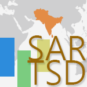

# Welcome {-} 

<div style= "float:right;position: relative;">
```{r echo=FALSE}

```
</div>

This book is about the analysis of household surveys from South Asian countries and is intended to be used as a manual by any researcher interested in using the South Asia Regional Micro Database (SARMD). The household surveys contained in SARMD provide a rich and open source of data on economic behavior and expenditure patterns, demographics, educational attainment, employment, the acquisition of durable assets, and housing. The harmonization of these surveys allows to compare social and economic statistics among the eight countries in the region.

These guidelines are intended to teach you everything you need to work efficiently with SARMD. You will learn how to access the microdata through the `datalibweb` system, how to perform basic (and not so basic) socioeconomic calculations, how comparable household surveys are across the region, how good the harmonization process is, and how to conduct analysis at the regional or country level by providing a series of case studies and findings. 

## About the technical composition of this book {-}

This book is written in [R Markdown](https://rmarkdown.rstudio.com/) syntax and compiled with the [bookdown](https://bookdown.org/yihui/bookdown/) package. The source files are available in the World Bank Github repository [worldbank/SARMD_guidelines](https://github.com/worldbank/SARMD_guidelines). To become a contributor to this project, please send an email to ... requesting for access. Once you are granted access, you may clone or fork this repository and start contributing. 

There are several advantages to composing books (especially technical books) using Markdown:

1. You can create different types of output formats such as PDF, HTML, WORD, EPub, and even Kindle files. 
2. Everything is written using plain text, so you may enjoy the benefits of tracking changes through collaborative platforms as Git. 
3. You can execute `R` or `Stata` code directly from the text, include code chunks, and present its corresponding results inline wherever you want within the document. 
4. You can add features like multi-page HTML output, numbering and cross-referencing figures/tables/sections/equations, inserting parts/appendices, and import [GitBook](https://www.gitbook.com) styles to create elegant and beautiful books.

## Software information and conventions {-}

The R session information used when this book was compiled is the following:

```{r session}
sessionInfo()
```

All the pieces of code are written `like this` and sometimes you may find chunks of code like this:

```stata
This is a chunk of code,
and everything in it may be copied and
pasted directly into the corresponding
execution console, which could be 
Stata or R.
```

Most of the code chunks in this book are written in `Stata` syntax, but you may find some pieces of code written in `R` language as well.  

