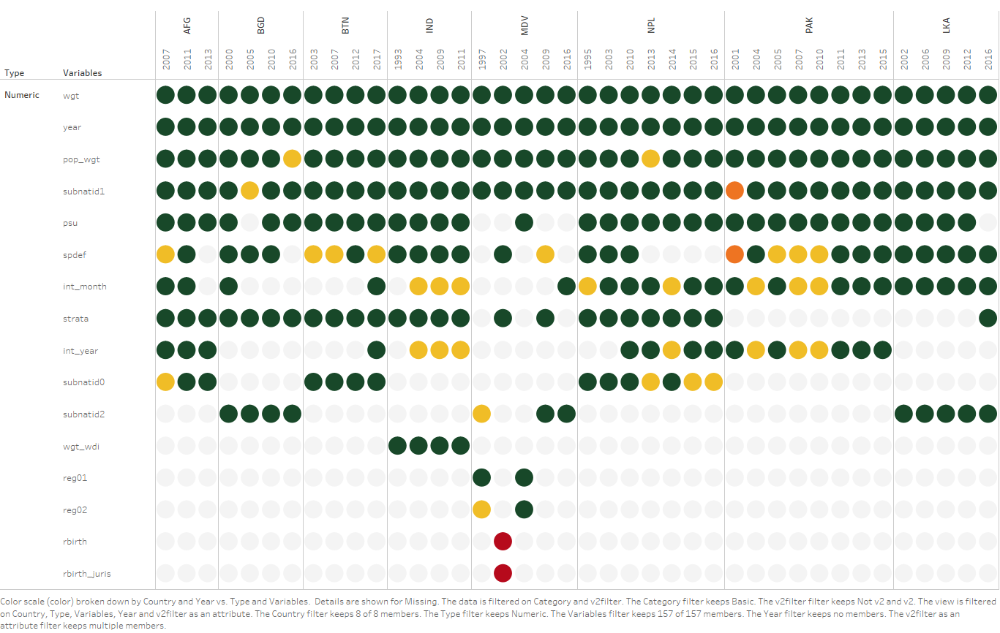
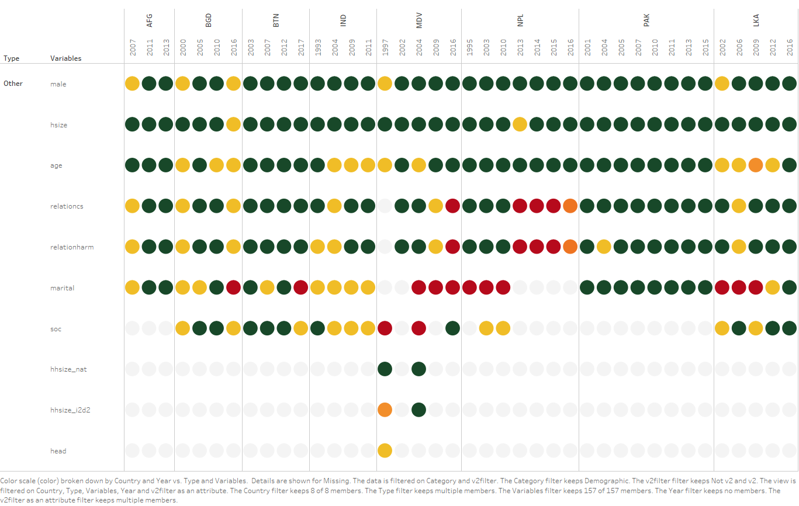
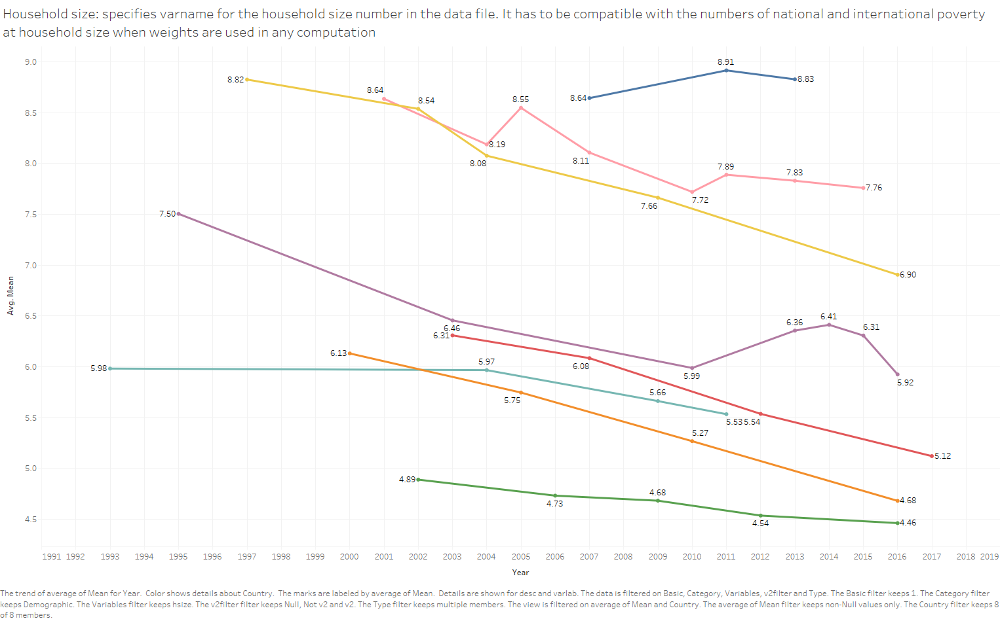
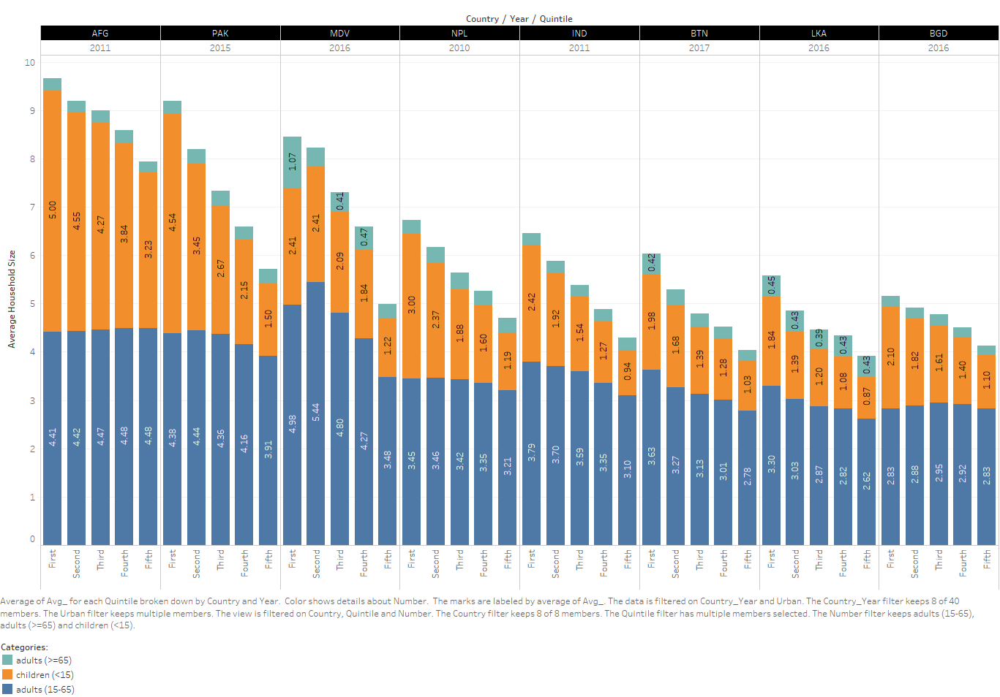
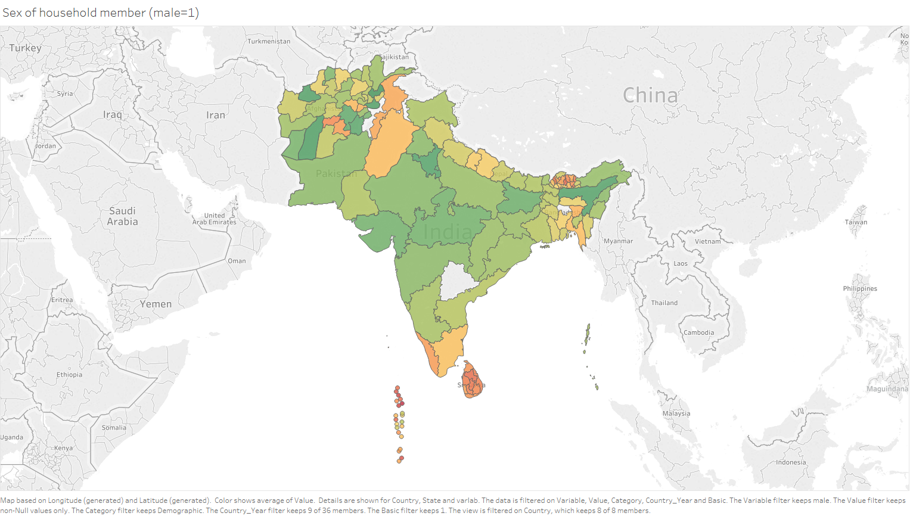
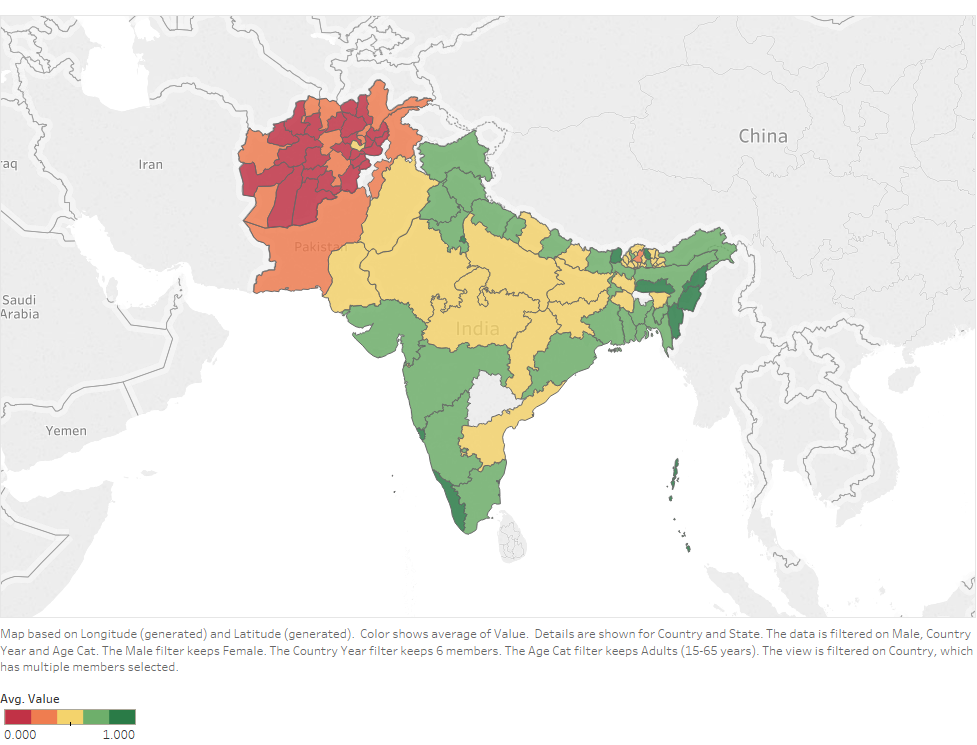
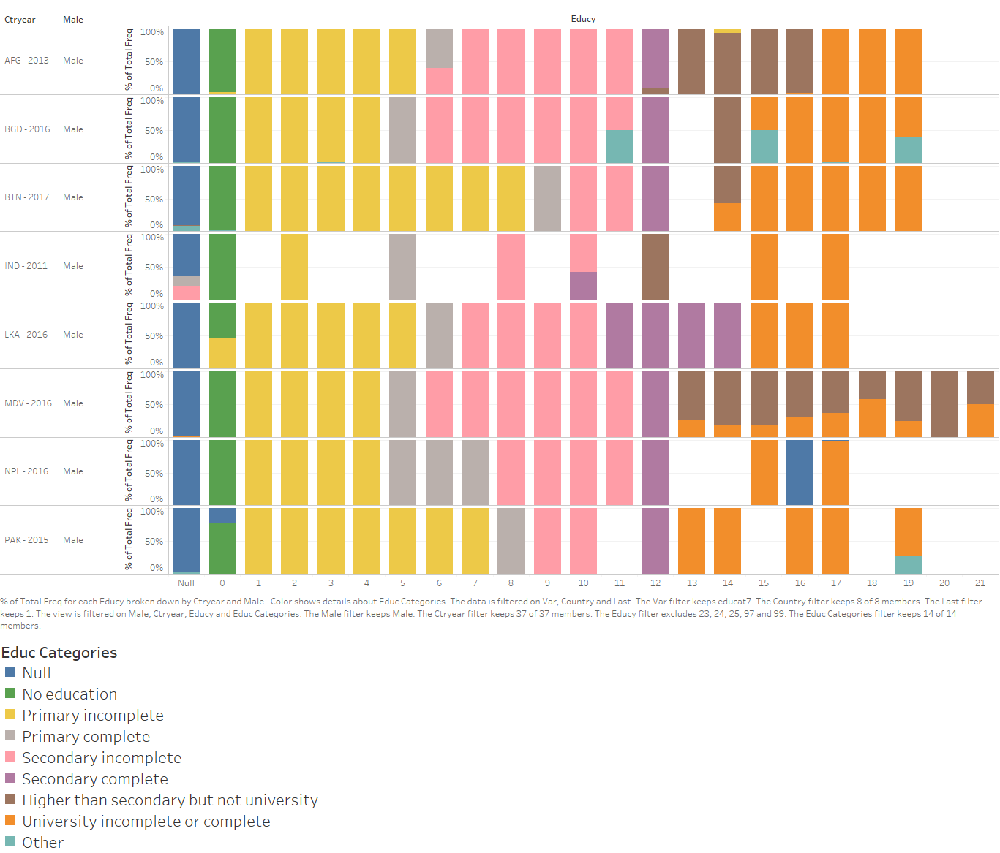
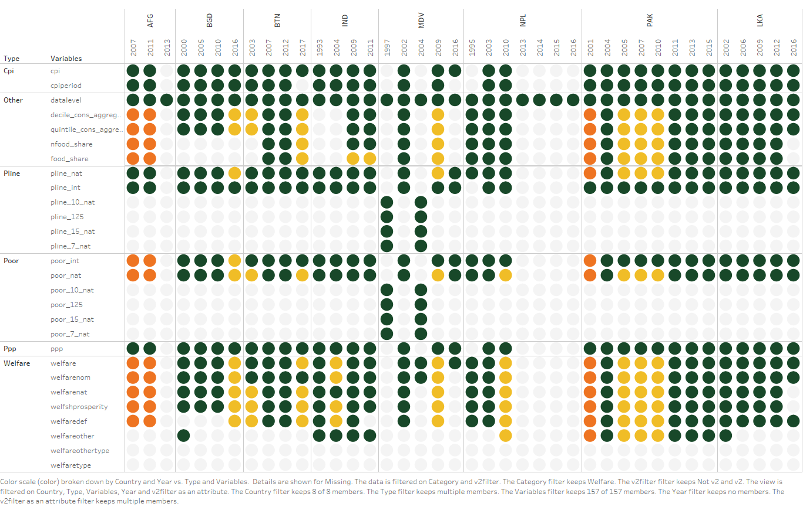

# Harmonized variables
***

Harmonized variables in SARMD are organized in 7 categories: basic, demographic, education, assets, house, labor, and welfare. The following Tableau dashboards display which variables are currently available for each household survey. The different colors indicate a variable's percentage of missing values.

```{r,eval=FALSE,echo=FALSE}
This chapter presents the harmonized data from the South Asia Micro Database (SARMD) with a series of quality checks to verify that each harmonized variable has been constructed properly. Two kinds of quality checks of the harmonized data have been conducted. A static quality check evaluates whether the harmonized variables are present and whether there is a high percentage of missing values. It also delves deeper into variables that may be interrelated with other variables. For example, a high percentage of households that have access to a television, but do not have access to electricity may raise questions on how these variables were constructed. A dynamic quality check evaluates the inconsistencies in measurement of harmonized data over time. It provides a better overview on whether categorical variables have changed over time and provides poverty and inequality measures. 
```

## Basic survey characteristics

[](https://tab.worldbank.org/#/site/WBG/views/SAR_MNA_Summary/Missing "The user may interact with this Tableau dashboard by clicking on the figure.")


```{r table0, echo=FALSE, results='asis'}
cat('|      countrycode|    veralt|    pop_wgt|   subnatid2|
|------------:|-----------:|------------:|--------------:|
|      year|         idh|     int_year| psu|
|    survey|         idp|   int_month|     strata|
|      vermast|        wgt|        subnatid1|spdef|')
```


The essential variables that identify each dataset are **countrycode**, **year**, **survey**, **vermast**, **veralt**, **idh**, and **idp**. Weights are defined as **wgt** and **pop_wgt=wgtxhsize**. The dates of the survey are recorded as **int_year** and **int_month**. The geographical location within the country’s administrative division is recorded as **subnatid1**, and in some cases, **subnatid2** may provide a more specific location. 
**psu**
**strata**
**spdef** 

## Demographic variables

[](https://tab.worldbank.org/#/site/WBG/views/SAR_MNA_Summary/Missing "The user may interact with this Tableau dashboard by clicking on the figure.")

```{r table1, echo=FALSE, results='asis', eval=FALSE}
cat('|      age|    male|    hsize|
|------------:|-----------:|------------:|
|      relationcs|        relationharm|        marital|')
```

There are currently six essential demographic variables in SARMD: **age**,  **hsize**, **male (0/1)**, **relationcs**, **relationharm** and **marital**. 

### age

The youngest country in the region is Afghanistan. The oldest is Sri Lanka. 

[](https://tab.worldbank.org/#/site/WBG/views/SAR_MNA_Summary/LineChart "The user may interact with this Tableau dashboard by clicking on the figure.")

### hsize

Household size is close to seven in Afghanistan, Pakistan and Maldives, and much closer to 4-5 in the rest of the countries. 

[](https://tab.worldbank.org/#/site/WBG/views/SAR_MNA_Summary/LineChart "The user may interact with this Tableau dashboard by clicking on the figure.")

[//]: # (## Household composition and expenditures)


The following dashboard shows how average household size declines as we move to higher quintiles of per capita expenditures. Average household size is 9.66 in the poorest per capita expenditure quintile of Afghanistan, compared to 3.91 in the richest per capita expenditure quintile of Sri Lanka. Having more children (individuals < 15 years old) is negatively correlated with household per capita expenditures. We would expect higher poverty rates among large households and households with more children. 

```{r children, echo=FALSE, warning=FALSE, eval=FALSE, error=FALSE, fig.cap='Average household size by per capita consumption quintile', out.width='80%', fig.asp=.75, fig.align='center'}

```

[](https://tab.worldbank.org/#/site/WBG/views/SAR_MNA_Demographics/Children "The user may interact with this Tableau dashboard by clicking on the figure.")

### male

Sex ratio is used to describe the number of females per 1000 of males. In India, and some other countries in South Asia, this ratio may be heavily skewed towards men.

[](https://tab.worldbank.org/#/site/WBG/views/SAR_MNA_Summary/LineChart "The user may interact with this Tableau dashboard by clicking on the figure.")

### relationcs

This variable refers to the original categories that indicate the relationship of an individual to the household head. They change from survey to survey and may include categories as:

- Household Head
- Husband/Wife
- Son/Daughter
- Grandchildren
- Grandfather/Grandmother
- Father or mother
- Father-in-law/Mother-in-law
- Brother or sister 
- Brother-in-law/sister-in-law 
- Nephew or niece
- Domestic servants
- Employee
- Other family relative
- Unrelated member

### relationharm

This variable refers to the simplified categories that indicate the relationship of an individual to the household head: 

- Household Head
- Spouse
- Children
- Parents
- Other relatives
- Non-relatives

### marital

This variables classifies individuals according to their marital status into this simplified categories: 

- Never Married
- Married 
- Divorced/separated
- Widowed
- Living Together

Population pyramids such as the one provided in Figure \@ref(fig:pyramid) allow to see how countries’ demographics change over time while showing whether the marital status of individuals has been harmonized adequately. About 63.7 percent of Afghans are under 25 years of age, reflecting a steep pyramid age structure.  

```{r pyramid, echo=FALSE, fig.cap='[Population Pyramid for Afghanistan (2013)](https://tab.worldbank.org/#/site/WBG/views/SAR_MNA_Demographics/Pyramid)', fig.align='center'}
knitr::include_graphics("./figures/Pyramid.png")
```

## Education

[](https://tab.worldbank.org/#/site/WBG/views/SAR_MNA_Summary/Missing "The user may interact with this Tableau dashboard by clicking on the figure.")

There are currently eight essential education variables in SARMD: literacy, atschool, everattend, ed_mod_age, educy, educat4, educat5, and educat7.

```{r table2, echo=FALSE, eval=FALSE, results='asis'}
cat('|      atschool|    ed_mod_age|    everattend|   literacy|
|------------:|-----------:|------------:|--------------:|
|      educat4|        educat5|        educat7|educy|')
```

### literacy

The adult literacy rate – referring to the population aged 15 and over – is an indicator that measures the accumulated achievement of the education system. The youth literacy rate – the literacy rate in the population aged 15-24 – reflects the outcomes of primary education over roughly the previous 10 years and is a measure of recent educational progress. 

[](https://tab.worldbank.org/#/site/WBG/views/Note3/Literacy "The user may interact with this Tableau dashboard by clicking on the figure.")

### atschool

### everattend

### ed_mod_age

### educy

Should not include pre-school. 

### educat4

[](https://tab.worldbank.org/#/site/WBG/views/SAR_MNAEducationbycategories/Percentages "The user may interact with this Tableau dashboard by clicking on the figure.")

### educat5

[](https://tab.worldbank.org/#/site/WBG/views/SAR_MNAEducationbycategories/Percentages "The user may interact with this Tableau dashboard by clicking on the figure.")

### educat7

[](https://tab.worldbank.org/#/site/WBG/views/SAR_MNAEducationbycategories/Percentages "The user may interact with this Tableau dashboard by clicking on the figure.")

## Durable assets

[](https://tab.worldbank.org/#/site/WBG/views/SAR_MNA_Summary/Missing "The user may interact with this Tableau dashboard by clicking on the figure.")

```{r table3, echo=FALSE, results='asis'}
cat('|      bicycle|    computer|    landphone|   refrigerator|
|------------:|-----------:|------------:|--------------:|
|      buffalo|         cow|     motorcar| sewing machine|
|    cellphone|         fan|   motorcycle|     television|
|      chicken|        lamp|        radio|washing machine|')
```

This section analyzes whether the sixteen asset variables in SARMD have been adequately harmonized and may be used for research purposes. These binary variables (Yes=1, No=0) represent whether households have access to a particular durable asset. The variables are defined at the household level and do not represent whether each individual owns an asset in particular, but whether the household as a whole has access to it. The harmonization of these asset variables is limited by their availability in the household questionnaire. For example, cow, chicken, and buffalo cannot be harmonized if a survey does not cover live-stocking activities. It may also be that some of these assets are unnecessary (a fan in cold weather), obsolete (land phone), or too basic (lamp) to be included in a questionnaire. 

Quality checks were conducted to make sure that these variables could only be equal to 0 or 1. We also verified that the value was the same within each household. A deeper look at these asset variables allowed to identify some interesting trends. Figure \@ref(fig:assets) displays the percentage of households that have access to an asset by country for the latest survey round available. It shows that cellphones are the most accessible assets and that there can be a wide range between the minimum and the maximum. 

```{r assets, fig.cap='Harmonized asset ownership in latest household survey round', out.width='80%', fig.asp=.75, fig.align='center'}
knitr::include_graphics("./figures/Assets.png")
```

see Figure \@ref(fig:assets) at https://tab.worldbank.org/#/site/WBG/views/SAR_MNA_Summary/Assets 


```{r scatter, fig.cap='Access to refrigerator and access to electricity across surveys', out.width='80%', fig.asp=.75, fig.align='center'}
knitr::include_graphics("./figures/Scatter.png")
```

see Figure \@ref(fig:scatter) at https://tab.worldbank.org/#/site/WBG/views/SAR_MNA_Summary/Scatter 


Figure \@ref(fig:scatter) shows a clear exponential trend between the percentage of households that have access to electricity and the percentage of households that have access to a refrigerator. A similar relationship with electricity was found for television, washing machine, and fan. A quality check was conducted to identify the number of observations where the household had no access to electricity, but still had access to an asset. In some cases, it might seem illogical, for example, for a household to own a television if it does not have access to electricity. In Afghanistan (2013), 7,771 out of 20,773 households seemed to have a television and no electricity. However, a mistake in the harmonization process was identified and this number was reduced to 3,119 out of 20,773 households once the mistake was fixed. Still, 13-20% of observations in Afghanistan have consistently reported having a television and no electricity. 

## Housing

[](https://tab.worldbank.org/#/site/WBG/views/SAR_MNA_Summary/Missing "The user may interact with this Tableau dashboard by clicking on the figure.")

The living conditions of the Afghan population are to a large extent determined by the conditions of housing, including facilities for drinking water and sanitation. Most people – 83 percent – live in dwellings that are constructed with non-durable materials and 44 percent live in conditions of overcrowding, meaning that there are more than three persons per room. The large majority of urban dwellers – 72 percent – live in slums or inadequate housing. 

## Labor

[](https://tab.worldbank.org/#/site/WBG/views/SAR_MNA_Summary/Missing "The user may interact with this Tableau dashboard by clicking on the figure.")

## Welfare

[](https://tab.worldbank.org/#/site/WBG/views/SAR_MNA_Summary/Missing "The user may interact with this Tableau dashboard by clicking on the figure.")

### Poverty

This section presents the latest data on regional extreme poverty rates using the international poverty line of US$1.90 in 2011 purchasing power parity dollars. Even though, Afghanistan is missing, the ALCS 2016-17 recorded a sharp deterioration in welfare of the Afghan population. The proportion of population living below the national poverty line increased from 34 percent in 2007-08 to 55 percent in 2016-17. The latest poverty figures imply that at the time of the survey, close to 16 million Afghans lived in poverty. 

Urban poverty lower than rural poverty. 


datalibweb, country(PAK) year(2015) type(GMD) mod(ALL) vermast(01) veralt(02) surveyid(PSLM)
gen welf_ppp = welfare/cpi2011/icp2011/365
gen poor190 = welf_ppp < 1.9
sum poor190 [aw=weight_h]


### Inequality
The Gini index for Afghanistan showed a small decrease between the surveys of 2011-12 and 2016-17, from 0.30 to 0.29. 
