# Welfare and access to durable assets in South Asia

***
> **Abstract:** 
>
> Economic inequality may cover a wide variety of topics, most commonly, the distribution of income, expenditures, and wealth. In this analysis, we study the unequal distribution of durable assets between different groups in South Asia. We find that the cumulative percentage of access to assets by expenditures per capita rarely behaves as a flat line, which means distribution of access to assets is unequal. For most assets, including energy-using assets such as refrigerators and televisions, we see a positive relationship between access and expenditures per capita. In contrast, it is also possible for assets (for example, bicycles) to become less accessible as households become richer, suggesting they may have the characteristics of inferior goods. We find access to most assets has increased rapidly, although unevenly for different levels of welfare. A few exceptions are assets that may be becoming obsolete, such as radios and land phones, for which access has decreased over time across the region for all levels of welfare. 

Energy-using appliances, such as refrigerators, are taken for granted among households in developed countries. However, in South Asia these assets are still scarce and owning a refrigerator, for example, can have important consequences on the well-being of a family. Refrigerators may be common in urban areas of New Delhi, but they are almost non-existent in central Afghanistan. We study how asset ownership increases with welfare with the help of harmonized data from SARMD. The possession of valuable assets that facilitate family labor in a meaningful way are quick indicators of household purchasing power and economic development in the region. 

In microeconomics, an Engel curve describes how household expenditure on a good or service varies with household's purchasing power. For normal goods, the Engel curve has a positive gradient. That is, as purchasing power increases, the quantity of assets demanded increases. For inferior goods, the Engel curve has a negative gradient. 

```{r angel, echo=FALSE, warning=FALSE, eval=TRUE, error=FALSE, results='markup', tidy=TRUE, cache=FALSE,  fig.cap="Engel curves for normal goods"}

read_csv("./tables/engel.csv", 
         col_names = TRUE, col_types = cols()) %>% 
  ggplot(aes(x=Wealth, y=Quantity))  +   
    geom_line(aes(linetype=types))

```

The harmonized asset variables in SARMD indicate, not the quantity demanded, but whether households have access to assets. For example: 

| Variable	    | Description                     	                |
|-------------	|-------------------------------------------------	|
| `bicycle`     | Household has access to a bicycle  (1 = Yes 0 = No)   | 
| `cellphone`	  | Household has access to a cellphone  (1 = Yes 0 = No) |
| `computer`    | Household has access to a computer  (1 = Yes 0 = No) |
| `landphone`    | Household has access to a landphone  (1 = Yes 0 = No) |
| `motorcar`    | Household has access to a motorcar  (1 = Yes 0 = No) |
| `motorcycle`    | Household has access to a motorcycle  (1 = Yes 0 = No) |
| `radio`    | Household has access to a radio  (1 = Yes 0 = No) |
| `refrigerator`    | Household has access to a refrigerator  (1 = Yes 0 = No) |
| `sewingmachine`	  | Household has access to a sewingmachine  (1 = Yes 0 = No) |
| `television`    | Household has access to a television  (1 = Yes 0 = No) |
| `washingmachine`    | Household has access to a washingmachine  (1 = Yes 0 = No) |

Therefore, we do not know the quantity of assets demanded by each household and we are not able to present an Engel curve as described above. However, we may calculate the percentage of households with access to the asset as shown in the following dashboard:

[](https://tab.worldbank.org/#/site/WBG/views/SAR_MNA_Summary/Assets "The user may interact with this Tableau dashboard by clicking on the figure.")

An estimated 368 million people live without electricity in their homes in South Asia, and even among those who have access, many do not own basic assets such as refrigerators, televisions, or washing machines. As more households currently living in poverty benefit from overall economic development, we would expect a considerable increase in households’ purchases of durable assets and energy use. @wolframm estimated that if one half of the households in India who do not own refrigerators were to buy one, annual nationwide electricity demand would rise by over 10 percent. 

The following dashboard shows how high access to a refrigerator may be in the Maldives, compared to the rest of the countries. The user may use the filters to display the same figure for a different durable asset. 

[](https://tab.worldbank.org/#/site/WBG/views/SAR_MNA_Summary/LineChart "The user may interact with this Tableau dashboard by clicking on the figure.")

We model the non-linear relationship between welfare and access to assets as in @fuchs. These authors provide a theoretical framework to characterize the effect of income growth on asset purchases when consumers face credit constraints. A non-linear Engel curve means that as income goes up from initially very low levels, credit-constrained households do not immediately become more likely to purchase energy-using assets. Households faced with credit constraints only become likely to purchase energy-using assets once their income passes a threshold level. 

In some cases, we have been able to find an S-shaped relationship between households' per capita expenditures and access to durable assets in the figures below. These figures show how unequal is the distribution of access to assets. A horizontal line would represent perfect equality in asset distribution, but that is rarely the case.  

[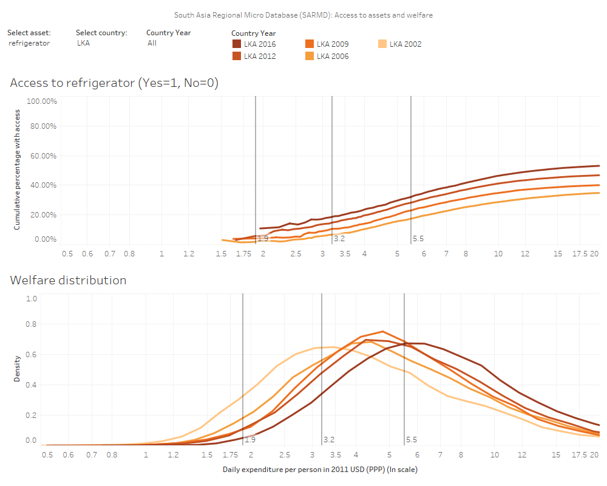](https://tab.worldbank.org/#/site/WBG/views/SAR_MNA_access_to_assets/AssetsandWelfare "The user may interact with this Tableau dashboard by clicking on the figure.")


### Bicycle

A negative slope may suggest bicycles are an inferior good, that is, it is more common for poor households to have access to them. 

[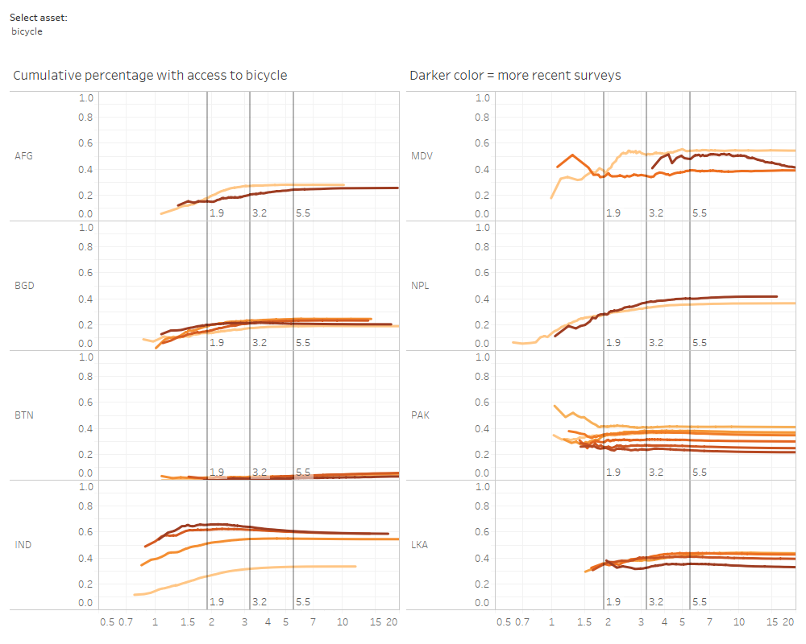](https://tab.worldbank.org/#/site/WBG/views/SAR_MNA_access_to_assets/AssetsandWelfare "The user may interact with this Tableau dashboard by clicking on the figure.")

### Cellphone

We see a quick increase in access to cellphones over time at all levels of welfare. 

[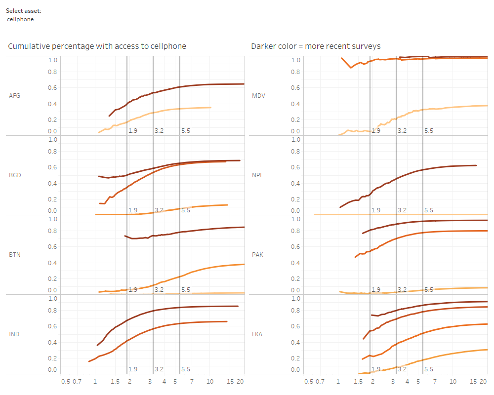](https://tab.worldbank.org/#/site/WBG/views/SAR_MNA_access_to_assets/AssetsandWelfare "The user may interact with this Tableau dashboard by clicking on the figure.")

### Computer

Access to computers only increases at levels of welfare above the poverty lines. 

[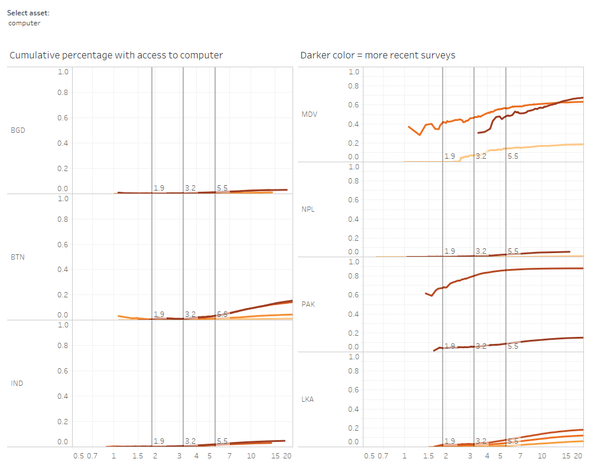](https://tab.worldbank.org/#/site/WBG/views/SAR_MNA_access_to_assets/AssetsandWelfare "The user may interact with this Tableau dashboard by clicking on the figure.")


### Electricity

Access to electricity is clearly lower for individuals below the 1.90 poverty line. 

[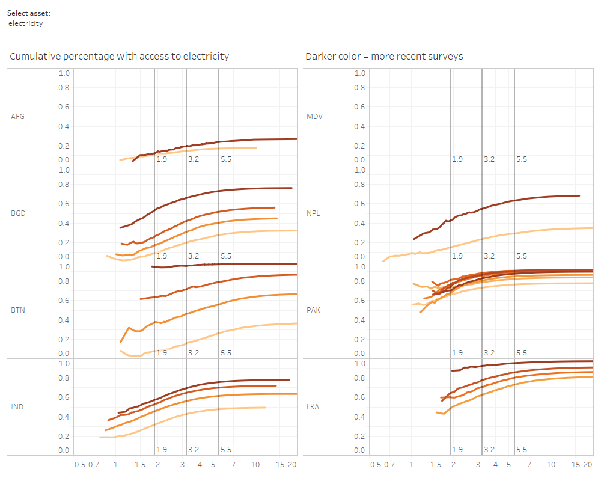](https://tab.worldbank.org/#/site/WBG/views/SAR_MNA_access_to_assets/AssetsandWelfare "The user may interact with this Tableau dashboard by clicking on the figure.")


### Ever attend school

This variable is technically not an asset, but we decided to include in this analysis. We can see positive slopes in every country, that is, poorer individuals are more likely to answer they have never attended any school. 

[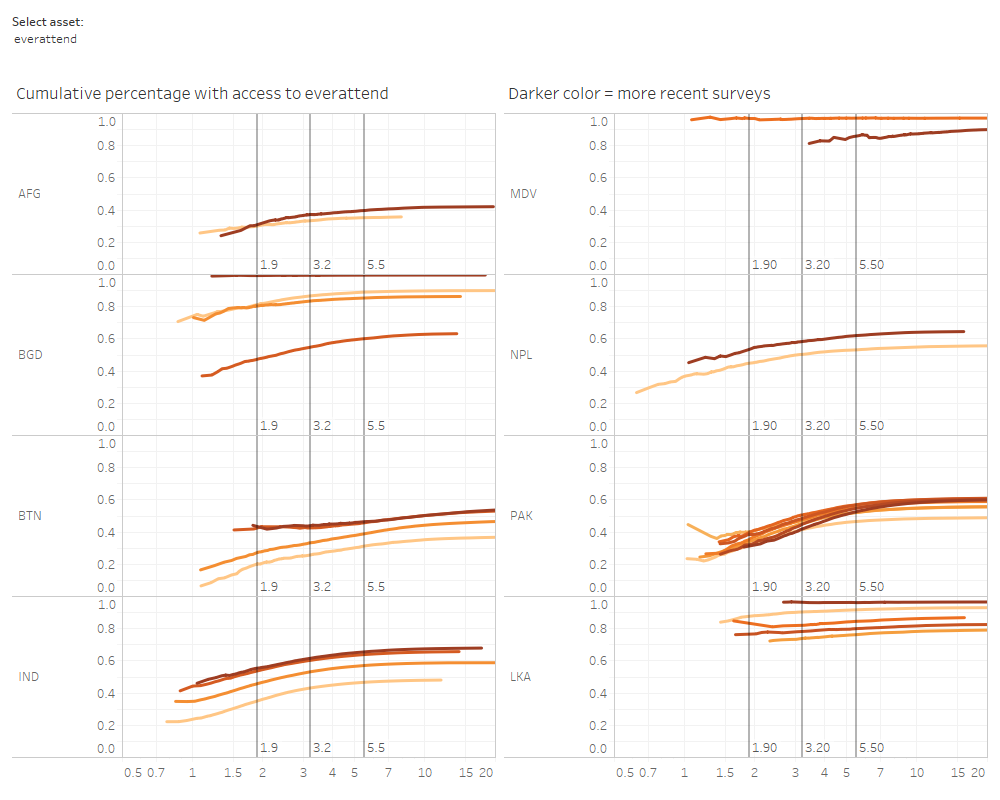](https://tab.worldbank.org/#/site/WBG/views/SAR_MNA_access_to_assets/AssetsandWelfare "The user may interact with this Tableau dashboard by clicking on the figure.")

### Fan

Having access to a fan is clearly related to welfare. Richer individuals may afford this luxury and may also be the only ones with access to electricity to be able to use a fan. 

[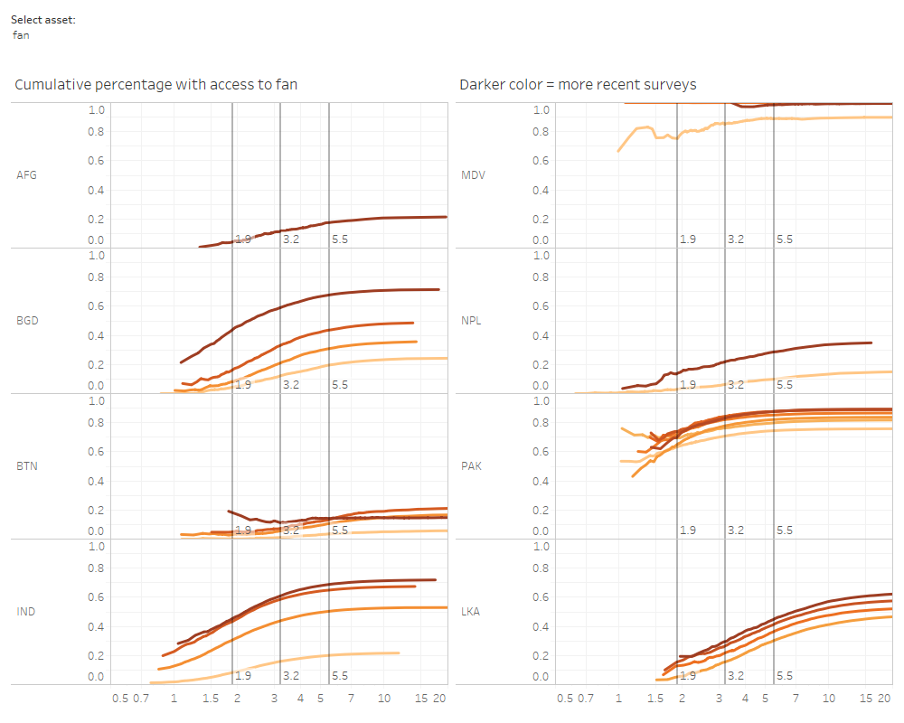](https://tab.worldbank.org/#/site/WBG/views/SAR_MNA_access_to_assets/AssetsandWelfare "The user may interact with this Tableau dashboard by clicking on the figure.")

### Land phone

Having access to a land phone is clearly becoming obsolete, especially compared to the levels of access to cellphone. 

[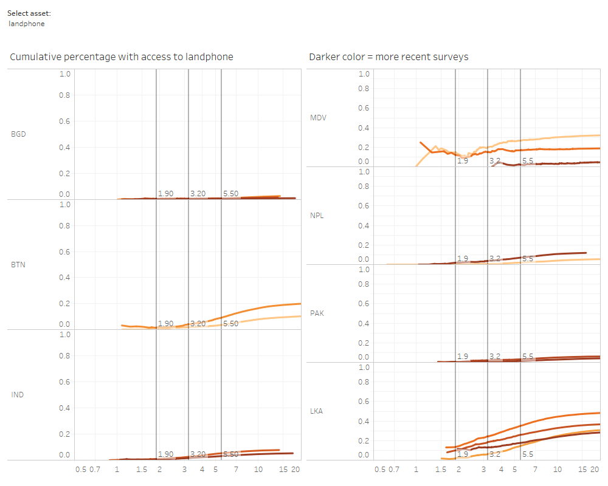](https://tab.worldbank.org/#/site/WBG/views/SAR_MNA_access_to_assets/AssetsandWelfare "The user may interact with this Tableau dashboard by clicking on the figure.")


### Literacy

Literacy is increasing over time and still related to welfare. Illiteracy is clearly more common among the poorest individuals. 

[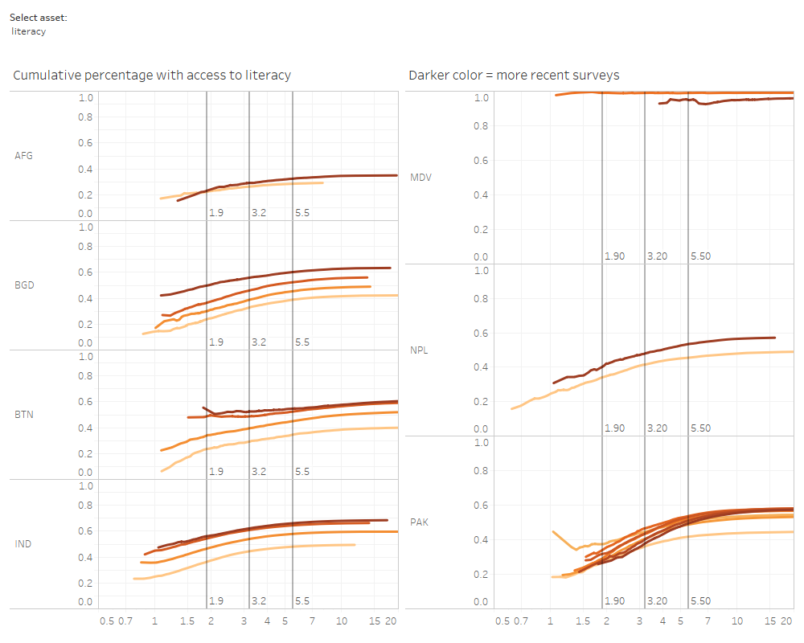](https://tab.worldbank.org/#/site/WBG/views/SAR_MNA_access_to_assets/AssetsandWelfare "The user may interact with this Tableau dashboard by clicking on the figure.")

### Motorcar

Having access to a motorcar seems to be more common for rich individuals in Afghanistan and Bhutan. 

[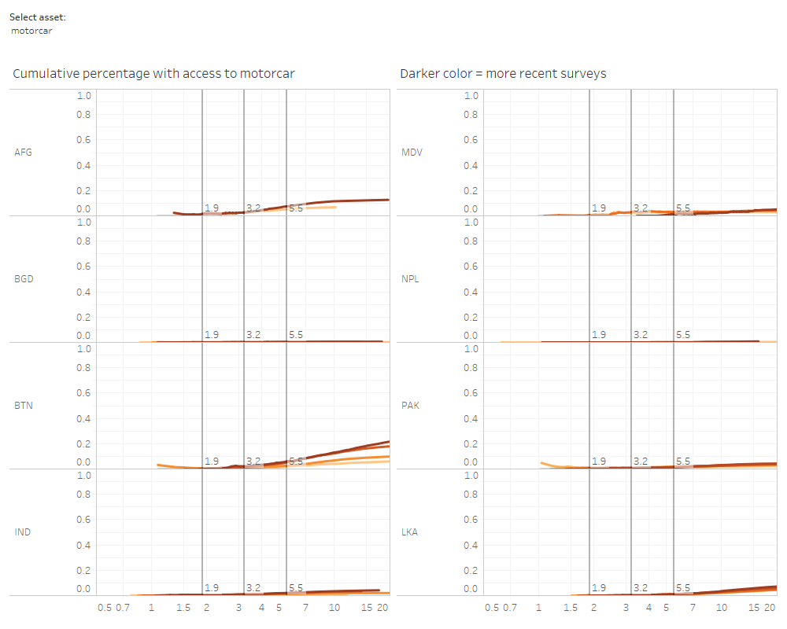](https://tab.worldbank.org/#/site/WBG/views/SAR_MNA_access_to_assets/AssetsandWelfare "The user may interact with this Tableau dashboard by clicking on the figure.")

### Motorcycle

Having access to a motorcycle is more common than having access to a motorcar. Having access to motorcycles has become more frequent over time, especially among richer individuals.  

[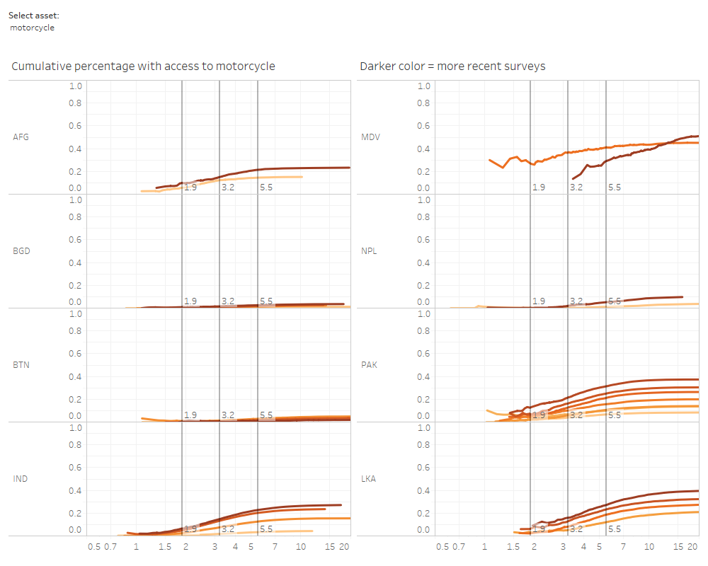](https://tab.worldbank.org/#/site/WBG/views/SAR_MNA_access_to_assets/AssetsandWelfare "The user may interact with this Tableau dashboard by clicking on the figure.")


### Own house

Compared to other assets, most households own the house they live in. Renting is common only among richer households in urban areas. 

[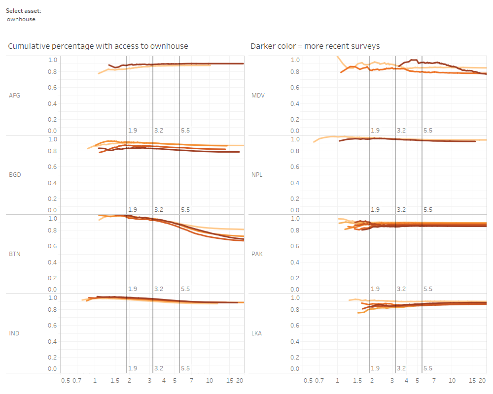](https://tab.worldbank.org/#/site/WBG/views/SAR_MNA_access_to_assets/AssetsandWelfare "The user may interact with this Tableau dashboard by clicking on the figure.")

### Piped water

Only Bhutan shows having almost universal access to piped water. 

[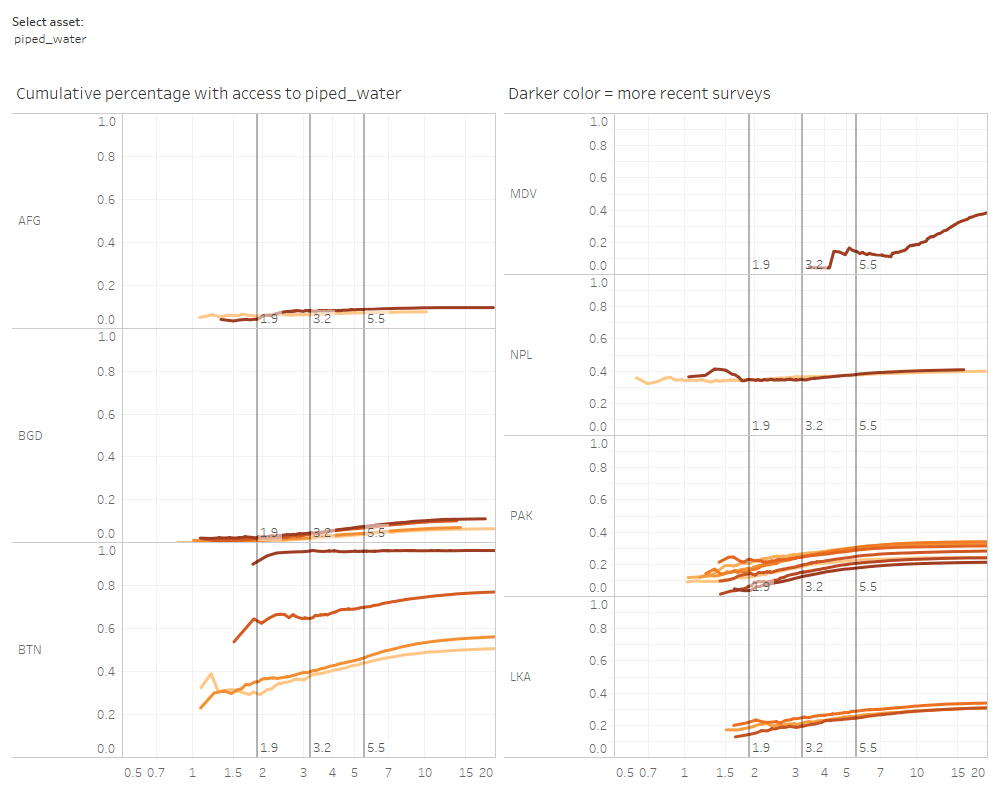](https://tab.worldbank.org/#/site/WBG/views/SAR_MNA_access_to_assets/AssetsandWelfare "The user may interact with this Tableau dashboard by clicking on the figure.")


### Radio

Another good that may be becoming obsolete are radios, with less households reporting having access to a radio over time at all levels of welfare.  

[](https://tab.worldbank.org/#/site/WBG/views/SAR_MNA_access_to_assets/AssetsandWelfare "The user may interact with this Tableau dashboard by clicking on the figure.")


### Refrigerator

Having access to a refrigerator seems to be strongly related to welfare, with average access to it growing fast around the 3.2 poverty line. 

[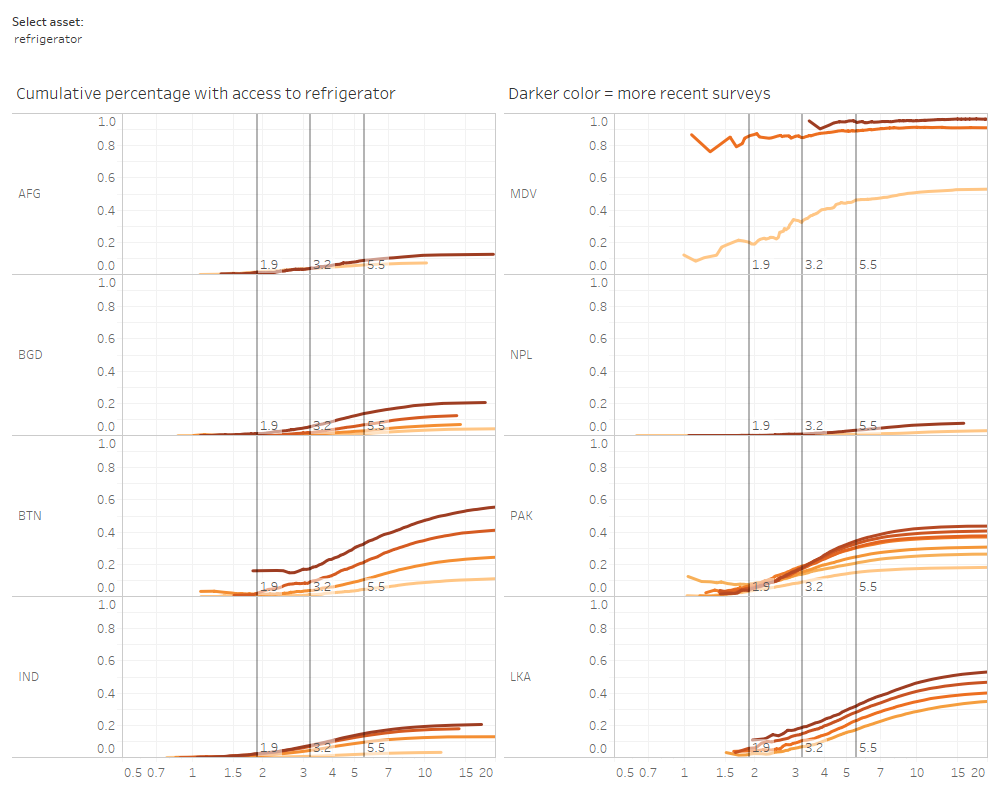](https://tab.worldbank.org/#/site/WBG/views/SAR_MNA_access_to_assets/AssetsandWelfare "The user may interact with this Tableau dashboard by clicking on the figure.")


### Sewage toilet

No country shows evidence of high access to sewage toilets. 

[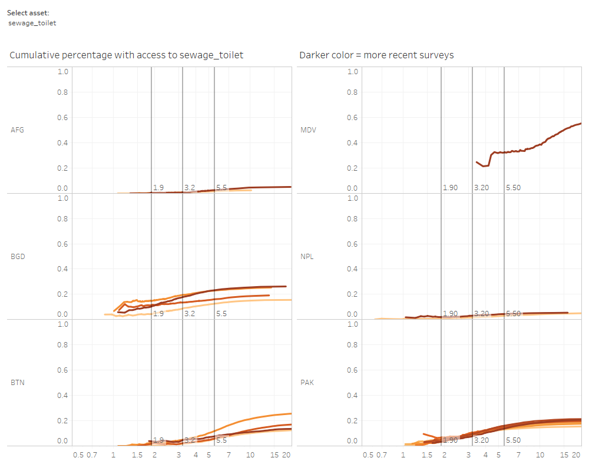](https://tab.worldbank.org/#/site/WBG/views/SAR_MNA_access_to_assets/AssetsandWelfare "The user may interact with this Tableau dashboard by clicking on the figure.")


### Sewing machine

Sewing machines seem to remain highly valuable in Afghanistan and Pakistan with more than 50% of individuals reporting having access to it. 

[](https://tab.worldbank.org/#/site/WBG/views/SAR_MNA_access_to_assets/AssetsandWelfare "The user may interact with this Tableau dashboard by clicking on the figure.")


### Television

Televisions are a highly-desirable durable asset and are clearly more common among richer households. Having access to a television depends on having access to electricity. Both electricity and television follow similar trends. 

[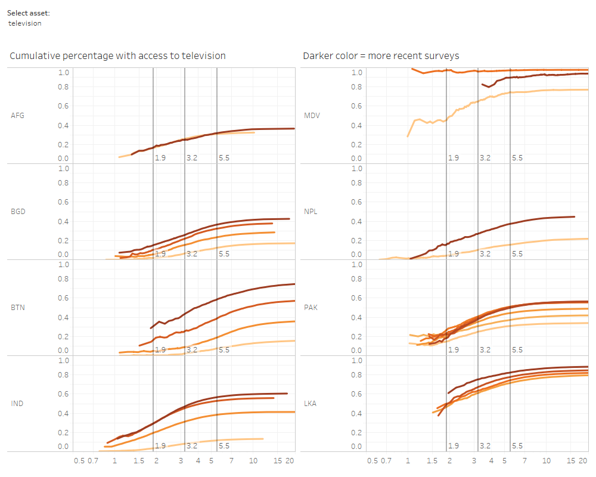](https://tab.worldbank.org/#/site/WBG/views/SAR_MNA_access_to_assets/AssetsandWelfare "The user may interact with this Tableau dashboard by clicking on the figure.")


### Washing machine

Having access to a washing machine is clearly a luxury and only common among the wealthiest. 

[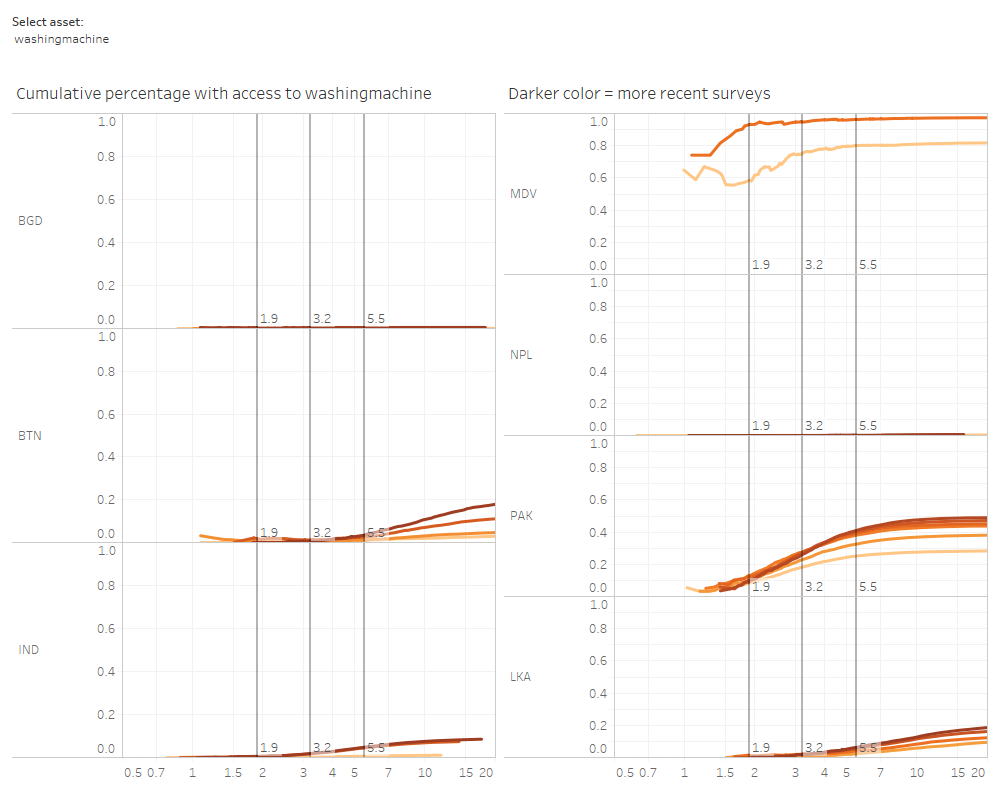](https://tab.worldbank.org/#/site/WBG/views/SAR_MNA_access_to_assets/AssetsandWelfare "The user may interact with this Tableau dashboard by clicking on the figure.")

```{r, eval=FALSE, echo=FALSE}
https://tab.worldbank.org/#/site/WBG/views/Note1/Dashboard1

  plots the share of households that own refrigerators, televisions, and washing machines in India (2011) against household expenditure. 

An estimated 368 million people live without electricity in their homes in South Asia, and even among those who have access, many do not own basic assets such as refrigerators, televisions, or washing machines. We study household decisions to acquire assets in the presence of rising incomes. Table ?? demonstrates the low penetration that these energy-consuming assets have in South Asia.  

demostrates how for a group of several assets, asset ownership is high in the Maldives and lower in the rest of South Asia. 

Filmer and Pritchett, 2001, argue that the first principal component of the household’s ownership of physical assets is highly correlated with household expenditure and can be used as a reasonable proxy. 

```
